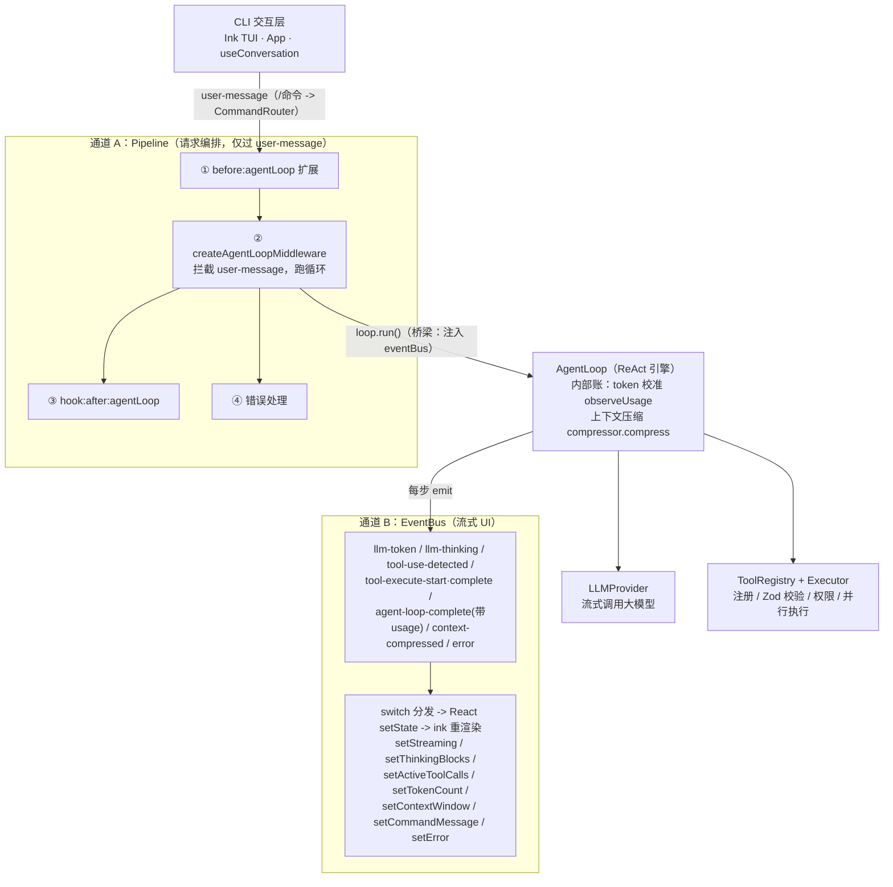
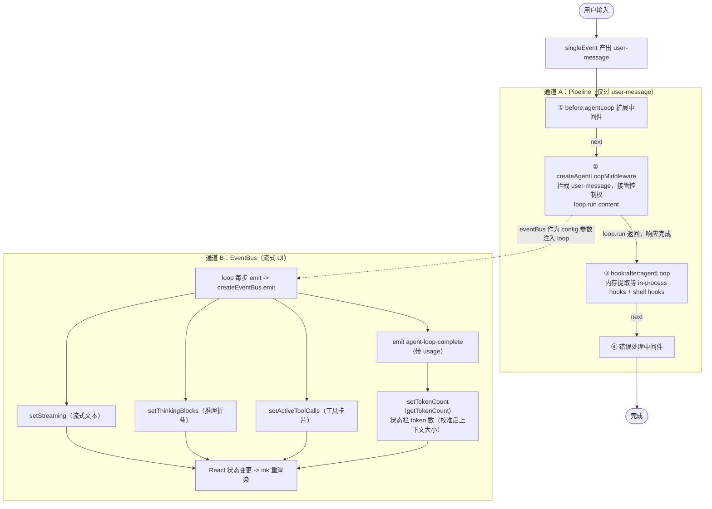
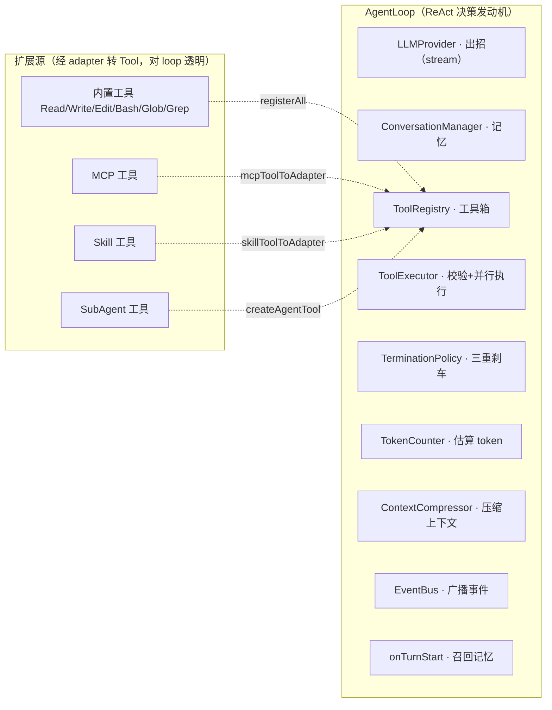

# LICode 用户指南

> LICode 是一个运行在终端里的 AI 编程助手。它能读懂你的代码库、执行 Shell 命令、编辑文件，
> 还能调用外部工具和多智能体协作。本指南帮你从零开始，逐步掌握所有功能。

---

## 目录

- [快速开始](#快速开始)
- [入门教程](#入门教程)
- [架构原理](#架构原理)
- [亮点功能与简历项目（STAR 法则）](#亮点功能与简历项目star-法则)
- [面试深挖问答（通俗到详细）](#面试深挖问答通俗到详细)
- [产物与目录结构](#产物与目录结构)
- [命令参考](#命令参考)
- [快捷键参考](#快捷键参考)
- [配置参考](#配置参考)
- [内置工具参考](#内置工具参考)
- [场景 Recipes](#场景-recipes)
- [常见问题](#常见问题)

---

## 快速开始

### 环境要求

- **Node.js** >= 20（package.json engines 要求）
- **包管理器**：pnpm（推荐）、npm 或 yarn
- **LLM API Key**：支持 Anthropic Messages API 兼容端点（如 Anthropic 官方、DeepSeek 的 /anthropic 端点；OpenAI 原生 /v1/chat/completions 不直接兼容，需第三方代理）

### 安装

```bash
# 克隆仓库
git clone https://github.com/your-org/LICode.git
cd LICode

# 安装依赖
pnpm install

# 构建所有包
pnpm build

# 设置 API Key（必填）
export ANTHROPIC_API_KEY="sk-your-api-key-here"

# 可选：指定 API 地址（使用第三方兼容 API 时）
export ANTHROPIC_BASE_URL="https://api.deepseek.com/anthropic"
```

### 第一次对话

```bash
# 启动 LICode
pnpm start
# 启动deepseek v4 pro（有think mode）
pnpm start -- --model deepseek-v4-pro
```

你会看到**欢迎页面**，显示历史会话列表。直接输入你的问题，按 Enter 开始新对话：

```
> 帮我看看这个项目里有哪些主要文件
```

LICode 会自动：
1. 扫描你的项目文件
2. 调用 LLM 理解你的意图
3. 在终端里流式输出回复
4. 必要时自动调用工具（读文件、搜索代码等）

### 恢复之前的会话

```bash
# 启动时指定会话 ID
pnpm start -- --session abc123

# 或者在欢迎页输入
> --session abc123
```

会话 ID 支持前缀匹配——输入前几个字符即可。

---

## 入门教程：你的第一个 LICode 项目

下面我们通过一个**完整的真实项目**来学习 LICode 的核心用法。假设你有一个 Express + TypeScript 后端项目，我们要用 LICode 给它添加"用户昵称修改"功能。

> **为什么选这个例子？** 它涵盖了真实开发的全流程：读代码 → 改数据库 → 写 API → 加校验 → 写测试 → 迭代修改。学完这一个例子，你就掌握了 LICode 80% 的日常用法。

---

### 第一步：让 LICode 理解你的项目

打开项目目录，启动 LICode，用自然语言告诉它你的项目长什么样：

```
> 这是一个 Express + TypeScript 后端项目，使用 Prisma 做 ORM，
  PostgreSQL 做数据库，Jest 做测试。
  项目入口是 src/index.ts，路由在 src/routes/ 下，
  数据库 schema 在 prisma/schema.prisma。
```

LICode 会自动用 `read` 和 `glob` 工具扫描项目结构、读取关键文件，建立对项目的理解：

```
▸ 读取代码
   读取 package.json → 确认依赖：Express, Prisma, Jest
   读取 prisma/schema.prisma → 发现 User 模型：id, email, passwordHash
   读取 src/routes/ → 已有 auth.ts, posts.ts
   理解完成：Express + Prisma + PostgreSQL 项目
```

> 💡 **这背后发生了什么？** LICode 使用 **ReAct（推理-行动）循环**：先"思考"需要了解什么，再调用工具获取信息，拿到结果后决定下一步行动。这跟你接手新项目时的行为一模一样——先看 `package.json`，再看入口文件，最后看具体模块。

---

### 第二步：提出功能需求

```
> 帮我添加"修改用户昵称"功能：
  1. 在 User 模型里加 nickname 字段（可选，最长 20 字符）
  2. 创建 PATCH /api/user/nickname 路由
  3. 校验：昵称不能为空字符串，不能包含特殊字符
  4. 写单元测试和集成测试
```

LICode 不会一口气全做完，而是**分步思考、逐步执行**：

```
▸ 分析逻辑
   需要 4 步完成：
   Step 1: 修改 Prisma schema，添加 nickname 字段
   Step 2: 运行 prisma migrate 创建数据库迁移
   Step 3: 创建路由和校验逻辑
   Step 4: 编写测试

   先从 Step 1 开始...
```

---

### 第三步：观察 LICode 逐步执行

每一步你都会看到对应的**工具调用卡片**，实时了解它在做什么：

**Step 1 — 修改数据库 Schema：**

```
● Edit  prisma/schema.prisma  ✓  model User 新增 nickname String? @db.VarChar(20)
```

**Step 2 — 创建数据库迁移：**

```
● Bash  npx prisma migrate dev --name add-user-nickname  ✓  迁移已创建，数据库已同步
```

**Step 3 — 编写路由代码：**

```
● Write  创建 src/routes/user.ts  ✓  PATCH /api/user/nickname + Zod 校验
● Edit   修改 src/index.ts  ✓  + app.use('/api/user', userRouter)
```

**Step 4 — 编写并运行测试：**

```
● Write  创建 src/routes/__tests__/user.test.ts  ✓  5 个测试用例
● Bash   npx jest -- user.test.ts  ✓  Tests: 5 passed, 5 total
```

---

### 第四步：修改和迭代

测试通过了，但你想调整一下逻辑——昵称应该允许中文。直接在对话中纠正：

```
> 昵称应该允许中文，把"不允许特殊字符"的校验改成
  "只允许中文、英文、数字和下划线"
```

LICode 会用 `edit` 精确替换 Zod schema 中的正则表达式，然后重新跑测试验证：

```
● Edit   修改 src/routes/user.ts:15  ✓  regex: /^[一-鿿\w]+$/
● Bash   npx jest -- user.test.ts  ✓  Tests: 6 passed, 6 total
```

> 💡 **这就是 LICode 的核心工作流**：描述需求 → LICode 规划并执行 → 你审查结果 → 纠正细节 → LICode 修改并验证。它像一个有超级执行力的结对编程伙伴，而不是一个需要你逐行指导的代码生成器。

---

### 第五步：理解 LICode 的思考过程

当 LICode 执行复杂操作时，屏幕上方会出现**可折叠的推理卡片**（Thinking Accordion）：

| 操作 | 快捷键 | 效果 |
|------|--------|------|
| 切换焦点 | `Ctrl+↑` / `Ctrl+↓` | 在不同卡片间移动 |
| 收起 | `Enter`（焦点在卡片时） | 取消焦点/收起（展开靠 Ctrl+↑/↓ 聚焦） |

展开推理卡片可以看到 LICode 的完整思考链：

```
▸ 分析逻辑

  用户要求修改昵称校验规则。
  当前规则：z.string().regex(/^[a-zA-Z0-9_]+$/)
  新需求：允许中文
  技术方案：将正则改为 /^[一-鿿\w]+$/
  
  影响分析：
  - 需要修改 src/routes/user.ts 第 15 行
  - 需要新增中文昵称测试用例
  - 不影响其他模块
  
  决定：修改 regex + 新增测试
```

---

### 第六步：查看工具调用状态

LICode 调用工具时，会显示**工具调用卡片**，有 4 种状态：

```
pending   ○ Grep  搜索 "fetch" 匹配

running   ◐ Bash  执行 npm test  运行中 ⠋

done      ● Read  读取 src/app.ts  ✓  120 行已读取

error     ✗ Bash  执行 npm run deploy
            Error: connection refused
```

---

### 第七步：使用 Slash 命令管理会话

在聊天中直接输入以 `/` 开头的命令：

| 命令 | 用途 | 示例场景 |
|------|------|---------|
| `/help` | 查看所有命令及用法 | 忘了某个命令怎么用 |
| `/context` | 查看模型、token 用量、消息数 | 对话很长，看看还剩多少 token |
| `/clear` | 清空对话历史 | 上个任务结束，开始新任务 |
| `/subagent` | 开关子 Agent 功能 | 需要并行处理多个独立任务 |
| `/memory` | 管理已存储的偏好 | 查看/删除之前记住的设置 |

---

### 🎯 学完这个教程，你已经能够：

| 能力 | 你在教程中做过的事 |
|------|-------------------|
| 让 LICode 读懂项目 | 描述项目结构，LICode 自动扫描验证 |
| 提出功能需求 | 4 步需求，LICode 自动拆解执行 |
| 读懂工具调用卡片 | 观察 edit → bash → write → test 全流程 |
| 迭代修改代码 | 纠正校验规则，LICode 精确修改并重测 |
| 审查推理过程 | 展开推理卡片，查看完整思考链 |
| 使用 Slash 命令 | /help、/context、/clear 管理会话 |

---

### 接下来学什么？

- **想了解 LICode 的内部原理？** → 继续阅读下方的 [架构原理](#架构原理)
- **想看更多实际场景？** → 跳到 [场景 Recipes](#场景-recipes)，每个 Recipe 都有可复现的完整示范
- **想配置自定义行为？** → 查看 [配置参考](#配置参考)，了解 CLAUDE.md、Skills、Hooks

---

## 架构原理

了解 LICode 的内部原理，可以帮助你更好地使用和信任它。

### 整体架构

LICode 运行时有**两条独立的事件通道**：Pipeline（请求编排）与 EventBus（流式 UI）。`createAgentLoopMiddleware` 是唯一桥梁——把 eventBus 注入 AgentLoop，所以 pipeline 包住 loop、loop 驱动 eventBus，两通道除此之外不交叉。



> **桥梁**：`createAgentLoopMiddleware` 构造时把 `eventBus` 作为参数注入 `AgentLoop`（loop.ts:278）——pipeline 包住 loop，loop 驱动 eventBus；两条通道除此之外不交叉。token 计数校准（`observeUsage`）与上下文压缩（`compressor.compress`）都在 AgentLoop 内部，不经过 pipeline 中间件；它们的 UI 通知（`agent-loop-complete` 带 usage、`context-compressed`）走 EventBus。

**分层说明：**

| 层 | 职责 | 关键组件 |
|----|------|---------|
| CLI 交互层 | 用户输入输出、界面渲染 | Ink/React 组件、useConversation Hook |
| 事件管线层（通道 A） | 请求编排，仅过 user-message | EventPipeline（before:agentLoop 扩展 -> createAgentLoopMiddleware -> hook:after:agentLoop -> 错误处理） |
| 流式 UI 通道（通道 B） | 循环内事件 -> 界面刷新 | EventBus（llm-token/thinking/tool-execute-*/agent-loop-complete/context-compressed/error -> React setState） |
| Agent 引擎层 | 决策循环与任务编排（含 token 校准、上下文压缩） | AgentLoop（ReAct）、TokenCalibrator、ContextCompressor |
| 工具执行层 | 文件、命令、搜索操作 | 6 内置工具 + MCP + Skills |
| LLM 适配层 | 大模型调用与 Token 管理 | LLMProvider、流式响应 |

### 1. CLI 交互层

LICode 使用 **Ink**（React for CLI）渲染终端界面。核心是一个**双视图状态机**：

```
欢迎页（选择会话/新建）  ←→  聊天界面（对话/工具/推理）
      ↑ Ctrl+Q 返回
```

**核心 Hook — `useConversation`：**

初始化时加载 LLM Provider、工具注册表、会话管理器和扩展系统。每次用户提交输入：
1. 先检查是否为 `/` 命令 → 路由到 CommandRouter
2. 否则创建 EventPipeline，注入中间件链
3. 生成 `user-message` 事件 → AgentLoop 拦截处理

### 2. EventPipeline（事件管线）

EventPipeline 用**洋葱模型**组织中间件：事件从外到内再从内到外流过每一层，每层可在进入时前置处理、`next()` 返回后做后置处理。实际注册的中间件链（`hooks.ts:706-729`，与 772-795 两处对称）只有 **4 层**：

```
① hookMiddleware(before:agentLoop)   ← 前置
  ② createAgentLoopMiddleware         ← 最内：拦截 user-message，跑 AgentLoop
  ③ hookMiddleware(after:agentLoop)   ← 后置
④ 错误处理                            ← 兜底
```

| 层 | 中间件 | 职责 |
|----|--------|------|
| ① 前置 | `hookMiddleware(before:agentLoop)` | 跑 before:agentLoop hook（见下） |
| ② 最内 | `createAgentLoopMiddleware` | 拦截 user-message，注入 eventBus，跑 `AgentLoop.run()`；loop 内部做 token 校准 `observeUsage` + 上下文压缩 `compressor.compress` |
| ③ 后置 | `hookMiddleware(after:agentLoop)` | 跑 after:agentLoop hook（见下），由 `emitAfterAgentLoop` 触发 |
| ④ 兜底 | 错误处理 | 捕获异常 -> `setError` |

**每个 hook 位置内置了哪些功能：**

hook 系统支持两类：**in-process function hook**（代码注册的 JS 函数）与 **shell hook**（用户在 `.licode/hooks.json` 配置的命令，见 §15）。`hookMiddleware` 在对应位置依次跑这两类。

- **before:agentLoop**：**无内置 function hook**（直通）；仅跑用户配置的 shell hook（若有）。
- **after:agentLoop**（由第 ③ 层 `emitAfterAgentLoop` 触发，两个内置 function hook 均 fire-and-forget、不阻塞）：
  - **memory-extraction**（`createMemoryExtractionHook`，hooks.ts:517）：每轮后由 `MemoryExtractor` 从对话提取记忆（5min 冷却等，见 §17）。
  - **memory-dream**（`memoryDreamHook`，hooks.ts:534）：dream 整理（24h+5 会话门，见 §17）；`LICODE_MEMORY_DREAM=off` 可关。
  - + 用户配置的 shell hook（若有）。

> **旧 middleware 的去向**：早期设计曾把 token 计数、上下文压缩、记忆都做成 pipeline 中间件（`tokenCountingMiddleware` / `contextMiddleware` / `memoryMiddleware`）；重构后三者都**不在 pipeline 上**--token 计数移进 loop（`observeUsage`）、上下文压缩移进 loop（`compressor.compress`）、记忆提取改成 after:agentLoop **hook**。`token-count.ts` 留为死代码、`context/middleware.ts` 已删源码（仅 dist 残留）、`memory/middleware.ts` 标 `@deprecated`。

### 2.1 两条事件通道：Pipeline 与 EventBus

LICode 运行时有**两条独立的事件通道**。理解它们的关系，是理解 token 计数、上下文管理与 UI 更新的关键。

**通道对比：**

```
┌─────────────── 通道 A：Pipeline (EventPipeline) ───────────────┐
│ 角色：请求编排（洋葱模型中间件链）                              │
│ 承载事件：仅 user-message 一个                                  │
│ 链路：① before:agentLoop 扩展                                   │
│      ② createAgentLoopMiddleware（拦截 user-message，跑循环）   │
│      ③ hook:after:agentLoop（内存提取 / shell hooks）          │
│      ④ 错误处理                                                │
│ 消费者：中间件（可拦截 / 预处理 / 后处理）                      │
└─────────────────────────────────────────────────────────────────┘

┌─────────────── 通道 B：EventBus (createEventBus) ──────────────┐
│ 角色：流式 UI 更新（循环内事件 -> React setState -> ink 重渲染）│
│ 承载事件：llm-token / llm-thinking / tool-use-detected /       │
│          tool-execute-* / agent-loop-complete（带 usage） /     │
│          error ...                                             │
│ 生产者：AgentLoop + collectResponse 每步 emit                   │
│ 消费者：createEventBus 的 switch 分发到 setStreaming /          │
│         setThinkingBlocks / setActiveToolCalls / setError /    │
│         setTokenCount / setContextWindow / setCommandMessage   │
└─────────────────────────────────────────────────────────────────┘
```

**一轮对话的流转（含通道交互）：**



**通道交互的本质：**

- **Pipeline 是外层控制流**：只过 `user-message` 一个事件，职责是"预处理 → 跑循环 → 后处理"。中间件之间用 `next()` 串联。
- **EventBus 是内层流式通道**：循环内部每一步（LLM token、工具调用、完成）都 emit 到这里，职责是"实时更新 UI"。
- **唯一的桥**：`createAgentLoopMiddleware` 构造时把 `eventBus` 作为参数**注入** agent loop。所以 loop 虽然跑在 pipeline 内部，却把事件发到 eventBus——可以理解为 **pipeline 包住 loop，loop 驱动 eventBus**。
- **两条通道除此之外不交叉**：pipeline 上的中间件看不到 eventBus 的事件，eventBus 也看不到 pipeline 的 `user-message`。

**为什么 token 计数不接在 `tokenCountingMiddleware` 上：**

```
                       校准（学 ratio）        显示（状态栏数字）
                       ─────────────          ──────────────
所在通道               都不在通道上            通道 B（EventBus）
所在位置               AgentLoop 内部          createEventBus 的
                       （observeUsage）         agent-loop-complete 分支
为什么在这             需要"调用前 base +       agent-loop-complete 每轮
                       调用后 usage"成对，      必发到 eventBus 且带 usage；
                       只有 loop 持有对话       不在 pipeline 上（收不到）

原 tokenCountingMiddleware  →  挂在 pipeline 上等 llm-response-complete
                                  ① agent-loop 路径不发该事件
                                  ② 就算发也只到 eventBus，pipeline 收不到
                                  故已从 pipeline 摘除（函数定义保留为死代码，Phase 1 收尾）
```

一句话：**pipeline 管"跑这一轮"，eventBus 管"把这轮的过程播给 UI"；校准是 loop 的内部账，显示是 eventBus 的播报——两者都不该、也不能接在 pipeline 的 `tokenCountingMiddleware` 上。**

### 3. AgentLoop（Agent 引擎）

AgentLoop 是 LICode 的核心决策发动机，实现 **ReAct（Reasoning + Acting）** 模式。

**AgentLoop 的组成：**

AgentLoop 直接持有九类部件；Skill/MCP/SubAgent 不在其中——它们经 adapter 翻译成统一的 `Tool` 注册进 ToolRegistry，被 loop 透明使用。



其中 LLMProvider / ConversationManager / ToolRegistry / ContextCompressor / EventBus / onTurnStart 为**注入**（来自 `AgentConfig`），ToolExecutor / TerminationPolicy / TokenCounter 为**内部构造**；内置工具 + MCP + Skill + SubAgent 经 adapter 转 `Tool` 注册进 ToolRegistry，对 loop 完全透明——新增一类扩展只需写 adapter，loop 无需改动。

**ReAct 循环时序：**

```
用户: "帮我读一下 src/app.ts"
         │
         ▼
   ┌─────────────┐
   │ addUserMsg   │  ← 用户消息加入历史
   └──────┬──────┘
          │
          ▼
   ┌─────────────┐      ┌───────────────────┐
   │ buildMessages│ ───→ │ LLM.stream()      │
   │ toLLMTools() │      │ 流式生成回复        │
   └─────────────┘      └────────┬──────────┘
                                 │
                    ┌────────────┴───────────┐
                    │    流式 chunk 类型       │
                    ├────────┬───────────────┤
                    │thinking│  token  │tool-use│
                    │ 推理中  │ 输出文字 │ 要调工具│
                    └────────┴────────┴───┬───┘
                                          │
                         ┌────────────────┴────────────┐
                         │  有 tool-use chunk？         │
                         └──────┬──────────┬───────────┘
                              是│          │否
                               ▼           ▼
                    ┌──────────────┐  ┌───────────────┐
                    │ToolExecutor  │  │返回 text 响应   │
                    │并行执行工具    │  │finalize + save │
                    └──────┬───────┘  └───────────────┘
                           │
                           ▼
                    ┌──────────────┐
                    │结果注入对话    │
                    │addToolMessages│
                    └──────┬───────┘
                           │
                           ▼
                    ┌──────────────┐
                    │继续循环 ──────┘
                    │(直到终止条件)
                    └──────────────┘
```

**三步终止保护：**

| 保护机制 | 默认值 | 触发后行为 |
|----------|--------|-----------|
| 最大步数（maxSteps） | 50 步 | 抛出 TerminationError，返回已有结果 |
| Token 预算（maxTokens） | 200,000 tokens | 同上 |
| 超时（maxTimeMs） | 10 分钟 | 同上 |

### 4. LLMProvider（大模型适配层）

LICode 通过 `LLMProvider` 接口抽象大模型调用，当前支持 Anthropic 兼容 API。

**流式响应的 5 种 chunk 类型：**

| chunk 类型 | 含义 | 前端表现 |
|-----------|------|---------|
| `thinking` | 模型推理过程 | ThinkingAccordion 实时展示 |
| `token` | 输出文字片段 | StreamRenderer 逐字渲染 |
| `tool-use` | 请求调用工具 | ToolCallCards 显示工具名和参数 |
| `stop` | 停止生成 | 返回最终 usage 统计 |
| `error` | 流中断 | UI 显示红色错误信息 |

**chunk 的去向：分叉为上下文与事件**

`collectResponse` 消费这些 chunk 时，按类型分叉到两股去向（外加一股内部账）：

| chunk | 写入上下文（ConversationManager） | 发出事件（EventBus） | 内部账 |
|-------|----------------------------------|---------------------|--------|
| `token` | `appendToAssistantMessage` 拼进助手消息 content | `llm-token` 逐字渲染 | |
| `thinking` | 不落上下文 | `llm-thinking` 折叠展示 | |
| `tool-use` | 收集后 `addToolMessages` 注入工具消息 | `tool-use-detected` / `tool-execute-*` | |
| `stop` | | | `usage` -> `observeUsage` 校准 |
| `error` | 不落上下文 | `error` 事件 | |

同一个 `token` chunk 既写上下文又发事件：上下文是“记忆”（持久、下轮 `buildMessages` 再发给 LLM），事件是“直播”（瞬时、刷 UI 即弃）；`thinking` 只走事件，因为推理过程不进 `AssistantMessage.content`。`collectResponse` 是分叉器，分出的两股分别落进 §2.1 的上下文与 EventBus 通道 B。

### 5. ToolRegistry（工具注册表）

所有工具（内置、MCP、Skills）统一注册到 `ToolRegistry`。

**工具注册流程：**

```
ToolRegistry.register(tool)
    │
    ├── 1. 存入 Map<name, Tool>
    ├── 2. Zod schema → JSON Schema (缓存)
    └── 3. 提供给 LLM 作为 function definition

LLM 调用工具时：
    │
    ├── 1. ToolExecutor 按名称查找工具
    ├── 2. Zod safeParse 校验参数
    ├── 3. PermissionGuard 权限检查
    └── 4. tool.execute(params, context)
```

### 6. ToolExecutor（工具执行器）

执行器负责参数校验、权限检查、并行执行：

- **参数校验**：用 Zod schema 自动验证 LLM 传回的参数
- **权限检查**：工具标记 `requiresApproval: true` 时触发 PermissionGuard
- **并行执行**：多个 tool-use 调用 `executeParallel()` → `Promise.all` 并发执行

### 7. 内置工具（6 基础 + 6 第二大脑）

| 工具 | 功能 | 适用场景 |
|------|------|---------|
| **Read** | 按行读取文件，支持 offset/limit | 查看代码、配置文件 |
| **Write** | 创建或覆盖文件 | 新建文件、更新内容 |
| **Edit** | 精确字符串替换 | 修改函数名、修改变量 |
| **Bash** | 执行 Shell 命令 | 构建、测试、git 操作 |
| **Glob** | 文件名模式匹配 | 查找特定类型文件 |
| **Grep** | 文件内容正则搜索 | 搜索函数调用、引用 |
| **decide** | 汇聚历史决定/事实/人物/近期日记，给决策分析（B/C framing） | 简单决策：二选一、低 stakes、当前上下文够用（见 §22） |
| **decide_plan** | 复杂决策的结构化规划：模型自填维度/选项/步骤，产出计划并驱动反思收敛 | 复杂决策：多维度/高 stakes/需定向召回（见 §22） |
| **decide_reflect** | side-call 小模型评估计划完备性，返回 passed/gaps/suggestions | decide_plan 产出计划后自动调用（见 §22） |
| **decide_save** | 用户确认后把决策记入日记（两步 gating，直写 journal 不进 memory） | decide/decide_plan 分析后用户同意记下 |
| **journal_recall** | 按话题/关键词搜索历史日记 | 回忆"之前那件事" |
| **profile_recall** | 按名字查找人物档案 | 回忆某人的特质/关系/互动 |

> 注：六基础工具注册名为 PascalCase（Read/Write/Edit/Bash/Glob/Grep），ToolRegistry 另有大小写不敏感回退，故小写亦可命中；第二大脑六工具为小写（decide 等）。

### 8. ConversationManager（对话管理器）

管理完整的消息历史，每条消息有明确的角色：

```
Message 类型：
  ┌──────────┐
  │ system   │  ← 系统提示词（角色、安全规则、工具说明）
  ├──────────┤
  │ user     │  ← 用户输入
  ├──────────┤
  │assistant │  ← LLM 文本回复（含 token 用量）
  ├──────────┤
  │assistant │  ← LLM 工具调用请求（ToolUseBlock[]）
  ├──────────┤
  │ user     │  ← 工具执行结果（ToolResultBlock[]）
  └──────────┘
```

**核心机制：**

- **Token 估算**：用 `TokenCounter`（char-class 启发式 + EMA 校准）估算消息 token 数
- **自动压缩**：token 超阈值时由 `ContextCompressor` 按轮次边界压缩（见 §10），旧版 `trimToBudget`（按下标切、会孤立 tool_result）已移除
- **持久化**：`save()/load()` 将对话保存为 `.licode/sessions/{id}.json`

### 9. SystemPrompt（系统提示词）

系统提示词采用**分层架构**，按优先级组装，受 token 预算约束：

```
优先级    层                类型      来源
  ─────────────────────────────────────────
   0    role（角色定义）     always    内置模板
   1    safety（安全规则）   always    内置模板
   3    current-date（今天日期）always  内置模板（相对日期归一化锚点，见 §17）
   4    memory-guide（记忆指引）按需   内置模板（见 §17）
   5    memory（记忆索引）   按需      MEMORY.md 自动注入（见 §17）
  10    tool-use（工具说明）  按需     内置模板
  10    CLAUDE.md           always    项目根目录（loaders 注入，always 不裁剪）
  12    spec files           按需      spec-kit 加载
  15    skills（技能描述）   按需      用户/项目配置
```

**组装策略：** `always: true` 的层始终包含，可选层按优先级依次填充，最后一个可选层可能被截断。

### 10. 上下文管理（Token 计数 + 压缩 + 恢复）

长对话的核心难题是 token 持续增长。LICode 分 5 期演进出一套**校准式计数 + 结构感知压缩 + git 指针恢复**的上下文管理（深度解析见 [亮点 3](#亮点-3长对话上下文管理) 与 [面试 Q9-Q12](#亮点-3-名词解释与深挖问答)）。

| Phase | 目标 | 核心机制 |
|-------|------|---------|
| 1 | 让 token 预测可信 | `TokenCounter` char-class 估算 + `TokenCalibrator` EMA 在线学习 ratio（用真实 `usage.input_tokens` 校准），零新依赖、后端无关 |
| 2+3 | 长会话"摘要续命"替代"撞墙即死" | 激活 `SystemPrompt.assemble(budget)` 分层裁剪；重写 `ContextCompressor` 按轮次边界切；移除有缺陷的 `trimToBudget` |
| 4 | 巨量工具输出不进会话 | `overflowToolResult`：>64KB 落盘 `.licode/overflow/` + 指针 + 预览 |
| 5 | 减少跨压缩细节丢失 | 滚动演化摘要 + 三层选择性保留 + write 轮压缩为 `file_change` 笔记 + git blob 恢复指针 |

**压缩触发**（`AgentLoop.run()` while 循环内、每步 LLM 调用前）：

```
if (!compressedThisRun && getTokenCount() > compressThreshold(0.85) × maxContextTokens(200k))
    -> compressor.compress()    // 每次 run() 至多压缩一次（compressedThisRun 守卫）
termination.check()             // 压缩后仍超 maxTokens 才硬停（最终兜底）
buildMessages(systemBudget)     // 压力下裁可选系统层
```

**压缩算法**（`ContextCompressor.compress`）：

```
1. splitIntoTurns：按 UserMessage 边界切轮（tool 对/recall 对天然在轮内，不切断）
2. classifyMiddleTurns 分四类：
     must-keep-error（含 is_error，原样保留）
     must-keep-write（含 Write/Edit，压缩为 file_change 笔记）
     candidate（其余，按 important/normal 分类）
     fold（孤儿轮，折进摘要）
3. 一次 side-call（CompressionAssistant）干三件事：分类 + file_change 描述符 + 滚动合并摘要
4. 组装：[firstUser, SUMMARY(assistant), ...mustKeep, ...important(预算允许), ...recentTurns]
5. 失败降级 trim（丢中间、折 firstUser 进 recent[0]），method="trim"，永不中断主循环
```

> ⚠️ **关键设计**：① 摘要用 `assistant` 角色放首条 user **之后**（不能用 system--会被 `extractSystem` 提顶层乱序；不能放第一条--数组 assistant 开头 API 报错）；② 旧 `trimToBudget` 按下标切会孤立 tool_result 导致 API 报错，已移除；③ 被压缩的 write 全文用 `git hash-object -w --stdin` 写成 git blob（**不产生 commit**，内容寻址 + 天然去重），可经 hash 精确恢复；④ 状态栏百分比直对应 `compressThreshold`（85% 即将压缩；100% 为硬上限仅在 maxContextTokens 与 maxTokens 都为默认 200k 时严格成立，二者是独立配置）。

### 11. TerminationPolicy（终止策略）

防止 Agent 陷入无限循环的三重保护：

```
TerminationPolicy.check(currentTokens)
    │
    ├── steps >= maxSteps ?   → 抛出 "达到最大步数"
    ├── tokens >= maxTokens ? → 抛出 "Token 预算耗尽"
    └── elapsed >= maxTimeMs ? → 抛出 "超时"
```

默认值：步数 50、Token 200K、时间 10 分钟。

### 12. Slash 命令系统

CommandRouter 拦截 `/` 开头的输入并路由到对应命令处理器：

| 命令 | 功能 | 实现状态 |
|------|------|---------|
| `/help` | 列出所有可用命令 | ✅ |
| `/clear` | 清空对话历史 | ✅ |
| `/context` | 显示模型、token、消息数、会话 ID | ✅ |
| `/memory`、`/memory-list`、`/memory-add`、`/memory-delete` | 记忆管理：查看、手动添加、删除 | ✅ |
| `/memory archive`、`/memory restore`、`/memory pin`、`/memory unpin` | 记忆归档/恢复/置顶（`/memory` 子命令，见 §17） | ✅ |
| `/diary`、`/diary-end`、`/diary-list`、`/diary-find`、`/diary-show`、`/diary-curate` | 第二大脑日记（见 §20、§23） | ✅ |
| `/subagent` | 开关子 Agent 支持 | ✅ |

### 13. MCP 协议（Model Context Protocol）

通过 MCP 协议接入外部工具服务：

```
MCPClientManager
    │
    ├── 1. 读取 .licode/mcp/config.json 配置
    ├── 2. 连接各 MCP Server（StdioTransport）
    ├── 3. 握手 → tools/list → 发现工具
    └── 4. 工具适配 → mcpToolToAdapter → ToolRegistry

工具命名：mcp__{server_name}__{tool_name}
```

**配置示例：**

```json
{
  "mcpServers": {
    "filesystem": {
      "transport": "stdio",
      "command": "npx",
      "args": ["-y", "@anthropic/mcp-server-filesystem"]
    }
  }
}
```

### 14. Skills 系统

用户和项目可以自定义技能包，存放在 `.licode/skills/` 目录下：

```
.licode/skills/
  └── my-skill/
      └── skill.md       ← YAML frontmatter + Markdown 描述
          ---
          name: my-skill
          version: 1.0.0
          tools:
            - name: deploy
              description: 部署到测试环境
              parameters:
                - name: env
                  type: string
                  default: staging
          ---
          # 技能描述正文（注入为 system prompt 层）
```

**加载流程：**
1. SkillLoader 设计上扫描用户目录（`~/.licode/skills/`）和项目目录（`.licode/skills/`）；注：当前 CLI 接线仅传入项目目录，`~/.licode/skills/` 暂未扫描
2. 项目级 skill 覆盖用户级同名 skill
3. 技能描述注入为系统提示词层（priority 15）
4. 技能工具注册到 ToolRegistry，命名空间 `skill__{toolName}`

### 15. Hooks 系统

在 Agent 生命周期的关键节点执行用户定义的 Shell 命令：

```json
// .licode/hooks.json - 扁平对象：name 作 key，每个值是一条 hook 配置（无 "hooks" 数组包裹；HookConfig 无 name 字段，name 即对象键）
{
  "log-conversation": {
    "events": ["agent-loop-complete"],
    "command": "echo '对话完成' >> licode.log",
    "position": "after:agentLoop",
    "blocking": false
  }
}
```

**生命周期节点：**
- `before:agentLoop` — Agent 开始处理前
- `after:agentLoop` — Agent 处理完成后

Hook 可以设为 `blocking: true`（阻塞等待完成）或非阻塞（fire-and-forget）。

### 16. Safety（安全机制）

**三层安全防护：**

| 层 | 机制 | 作用 |
|----|------|------|
| 系统提示词 | 内置安全规则 | 禁止危险命令、保护敏感信息、确认破坏操作 |
| 权限守卫 | PermissionGuard | 工具标记 `requiresApproval` 时弹窗确认 |
| 沙箱 | macOS sandbox-exec | 限制命令的读/写/网络权限 |

**权限检查流程：**
1. 检查 PermissionRule 白名单 → 匹配则放行
2. 检查会话缓存 → 同一工具+输入已批准过则放行
3. 弹窗询问用户 → allow-once / allow-session / deny

**沙箱（仅 macOS）：**
```
默认：拒绝所有操作
  ├── 允许：进程执行
  ├── 允许：读取所有文件
  └── 限制：写入仅限 cwd 及其子目录
```

### 17. Memory（记忆系统）

LICode 拥有跨会话的持久记忆：它能记住你是谁、你喜欢怎样协作、项目有哪些不成文的约定，并在后续对话中主动用上。经过 Phase 1-4 的持续演进（**Phase 1 生产层修复** + **Phase 2 召回层升级** + **Phase 3 做梦整理** + **Phase 4 归档/置顶/用量追踪**）以及日期归一化、可读文件名两项加固，记忆从"只进不出的记事本"升级为"会更新、会召回、会整理、不打扰"的完整系统。

#### 改进亮点

| 亮点 | 说明 | 来自 |
|------|------|------|
| **记忆会动态更新** | 先说"我喜欢红烧排骨"，后说"不喜欢了"——同一个记忆文件被改写，不会出现"喜欢/不喜欢"矛盾并存 | Phase 1 |
| **双路径生产** | 明确说"记住"→ 主 Agent 当场写入；日常对话 → 后台 LLM 自动提取（5 分钟冷却控制成本） | Phase 1 |
| **纠正/决策类不再漏检** | "不对，以后都用 pnpm"不含关键词，旧版关键词门槛直接漏掉；新门槛为冷却 + 问句排除，不再依赖关键词 | Phase 1 |
| **按查询召回正文** | 每轮对话由小模型从索引中选出 ≤5 条相关记忆，把**正文**注入当轮上下文；无关问题（如"帮我重构函数"）一条都不选 | Phase 2 |
| **召回透明可见** | 召回在对话流中显示为 `[调用工具: memory_recall]` 卡片，你能看到 LICode 想起了什么 | Phase 2 |
| **会话内即时生效** | 本会话刚写的记忆，后续轮次即可被召回（无需重启）；system prompt 索引每轮自动刷新 | Phase 2 |
| **失败零干扰** | side query 失败/超时（10s）→ 自动退回"仅索引"模式，对话不受影响；`LICODE_MEMORY_RECALL=off` 可整体关闭召回 | Phase 2 |
| **做梦整理** | 后台"做梦"（dream）定期整理整个记忆库：找漂移/重复 -> grep 证据 -> 合并/改写/删除 + 自动归档 >30 天未用记忆；零 LLM 门（24h+≥5 新会话），fire-and-forget 不阻塞用户 | Phase 3+4 |
| **自动归档与恢复** | >30 天未被召回的记忆自动归档（软删除，`/memory-restore` 可恢复）；`/memory-pin` 标记的永不归档；归档判定用 lastUsedAt 而非 createdAt（避免召回关闭时误归档所有从未召回的记忆） | Phase 4 |
| **日期归一化** | 相对日期（昨天/上周/下个月）在三处统一转绝对日期：extractor prompt 注入今天 + `save()` 程序化归一化 + Write-path hook（主 Agent 直写时补归一化），消除"昨天"导致的记忆错乱 | 2026-08-01 |
| **可读文件名** | 文件名用 `cleanName`（保留中文，人可读）与 slug（`toSlug`，中文 hash 兜底，程序标识）解耦；人物档案用 canonicalName（中文）做文件名，重命名不破坏引用 | 2026-08-01 |

#### 存储层：四类记忆 + 自动索引（两阶段共用）

```
.licode/memory/
├── MEMORY.md               ← 索引：每条一行 "- [名称](slug) — 描述"（自动重建，勿手改）
├── user/                   ← 用户角色、经验、偏好、目标
│   └── food-preferences.md
├── feedback/               ← 用户纠正/确认过的协作方式（必含 Why: / How to apply:）
│   └── use-pnpm.md
├── project/                ← 无法从代码/git 推导的项目背景与决策
└── reference/              ← 外部系统、看板、频道入口
```

单条记忆文件（YAML frontmatter + 正文，一个主题一个文件）：

```markdown
---
name: 食物偏好
description: 用户喜欢吃辣，不喜欢红烧排骨
type: user
createdAt: 2026-07-27T10:00:00.000Z
updatedAt: 2026-07-28T09:30:00.000Z
usageCount: 3
lastUsedAt: 2026-08-01T09:30:00.000Z
pinned: false
---

用户喜欢吃辣；2026-07-28 起不再喜欢红烧排骨。
```

#### 生产原理（Phase 1）：两条写入路径 + 自动协调

```
路径 1（明确指令）：你说"记住：我的编辑器是 Neovim"
  → 主 Agent 按 memory-guide 指引层（system prompt，priority 4）
    当场用 Write 工具写入 .licode/memory/user/editor.md

路径 2（日常对话）：agent loop 结束 → after:agentLoop hook（fire-and-forget）
  1. 互斥锁：已有提取在跑 → 直接跳过（不排队）
  2. 主 Agent 本轮已写过记忆（mtime 检测）→ 只重建索引，跳过提取（防重复）
  3. 轻量门槛：无新用户消息 / 全是问句 → 跳过；
     "记住"等明确指令 → 绕过冷却立即提取；距上次 <5 分钟 → 跳过
  4. LLM 提取：prompt 携带全部现有记忆正文 + 最近对话，
     输出 [{action, slug, type, name, description, content}]
  5. 落盘：create 新建 / update 改写正文 / append 段落去重追加
  6. MEMORY.md 索引自动重建
```

**矛盾处理的关键**：提取 prompt 携带现有记忆的**正文**（而非仅索引）——LLM 发现"不喜欢红烧排骨了"与旧的"喜欢红烧排骨"冲突时，输出 `update` 整体改写该文件（保留 createdAt，刷新 updatedAt），以最新信息为准。

#### 召回原理（Phase 2）：side query + 合成 tool_call 注入

每轮对话，agent loop 在首次调用大模型**之前**（`AgentConfig.onTurnStart` 挂点）执行：

```
1. 刷新索引层：重读 MEMORY.md，内容有变化才更新 system prompt 的 memory 层
   （本会话新写的记忆由此进入索引）
2. 剪除：移除上一轮注入的召回对（历史中任意时刻最多一对，token 不累积）
3. side query：小模型读取磁盘最新索引 + 你的当前消息，
   选出 ≤5 条相关记忆（slug 必须真实存在于索引，幻觉被过滤）
4. 注入：把选中记忆的正文作为合成 tool_call 对追加到你的消息之后：

   [..., U(今晚吃什么好？), A(调用 memory_recall), U(tool_result: 记忆正文)]
                                                          ↑ 模型从这里继续回答
```

- **为什么是 tool_call 而不是拼进你的消息**：不改动 system prompt 和你的原文；消息角色严格交替，所有 provider 兼容；TUI 渲染为工具卡片，召回透明可见。
- **降级**：索引为空 → 不发起 LLM 调用（零成本）；side query 失败/超时 10s → 本轮只剪除不注入，退回"仅索引"，对话完全不受影响。
- **开关**：`LICODE_MEMORY_RECALL=off` 启动即整体关闭召回，退回仅索引模式。
- **主 Agent 兜底**：未被 side query 选中的记忆，主 Agent 仍可按 memory-guide 指引用 Read 工具自行查阅 `.licode/memory/` 目录。

#### 做梦整理原理（Phase 3+4）：四阶段 + 零 LLM 门

记忆库会定期"做梦"整理（`MemoryDream`，深度解析见 [面试 Q5-Q7](#亮点-1-名词解释与深挖问答)）：

```
after:agentLoop hook（fire-and-forget，不阻塞用户）
   │
   ├─ shouldDream（零 LLM 门）：距上次 ≥24h 且自上次起 ≥5 个新会话才触发
   ├─ acquireLock（O_EXCL 原子锁，30min 过期覆盖，崩溃不永久阻塞）
   │
   ▼ dream() 四阶段（永不 reject，失败不更新 state 可重试）
   1. Orient（LLM）：审现有记忆（索引+全文），输出 suspicions（漂移/重复/失效/相对日期）
   2. Gather（无 LLM）：grep 近期会话新消息找证据片段（±1 条上下文，≤5 条/suspicion）
   3. Consolidate（LLM）：基于证据出 create/update/append/delete ops
      + Phase 4 规则驱动自动归档（>30d 未用且非 pinned -> archive，可 /memory-restore 恢复）
      + delete 前先备份到 .dream-backup/
   4. Prune：重建索引；>200 行或 >25KB 则 LLM 缩短 description 至 ≤150 字符
```

**安全机制**：① 删除前 `backupAndDelete` 备份文件 + MEMORY.md；② 归档是软删除（移到 `archive/{type}/`），`/memory-restore` 可恢复；③ pinned 记忆硬条件排除，永不归档；④ 失败时不更新 `.dream.state`，下次重试。

**并发让位**：dream 运行时，召回的 `recordUsage` 让位（避免写写竞态），但召回读路径不让位；提取 hook 同理检测 dream 状态。`recordUsage` 写回后用 `utimes` 恢复原 mtime，避免触发"主 Agent 已写则跳过提取"的误判。

#### 涉及文件及各自作用

| 文件 | 作用 |
|------|------|
| `packages/core/src/memory/store.ts` | **MemoryStore**——存储底座。`save(memory, action)` 实现 create/update/append 三种写入语义；`rebuildIndex()` 重建 MEMORY.md 索引；`hasChangesSince()` 用 mtime 检测主 Agent 的直接写入 |
| `packages/core/src/memory/extractor.ts` | **MemoryExtractor**——生产路径 2。轻量门槛（冷却 / 问句排除 / 明确指令绕过）+ 携带全部现有记忆正文的提取 prompt + 输出校验落盘 |
| `packages/core/src/memory/hook.ts` | **提取钩子**——共享状态（互斥锁 / 上次提取时间 / 本轮开始时间），协调"主 Agent 已写则跳过提取"与索引重建 |
| `packages/core/src/memory/recall.ts` | **MemoryRecall**——召回引擎。side query 选择（永不抛异常，失败返回空）；召回对的构造/剪除纯函数；`createMemoryRecallHandler` 生成每轮回调（刷新索引层 → 剪除 → 选择 → 注入） |
| `packages/core/src/memory/loader.ts` | **MemoryLoader**——会话启动时把 MEMORY.md 索引注入 system prompt（priority 5 层） |
| `packages/core/src/memory/dream.ts` | **MemoryDream**--做梦整理引擎（Phase 3+4）。四阶段 Orient/Gather/Consolidate/Prune；零 LLM 门 shouldDream；O_EXCL 锁；createMemoryDreamHook fire-and-forget（archive/restore/recordUsage/setPinned 等存储操作实现在 store.ts 的 MemoryStore 上，dream 仅调用） |
| `packages/core/src/conversation/templates/memory-guide.md` | **主 Agent 指引层**（priority 4）——教主 Agent 何时写 / 如何写 / 不写什么 / 如何用 Read 查记忆 |
| `packages/core/src/agent/loop.ts` | **AgentLoop**——`AgentConfig.onTurnStart` 挂点：召回注入的唯一入口（addUserMessage 之后、首次 LLM 调用之前，异常不阻断 loop） |
| `packages/cli/src/hooks.ts` | **CLI 接线**——创建 store/extractor/recall，注册 after:agentLoop 提取 hook，为两处 pipeline 配置 onTurnStart，读取 `LICODE_MEMORY_RECALL` 开关 |

#### 它们如何搭配（一轮对话的全景）

```
你说"今晚吃什么好？"
  │
  ├─ AgentLoop.run() 把你的消息入列
  ├─ onTurnStart（recall.ts + store.ts）：刷新索引层 → 剪除旧召回对
  │    → side query 选中 user/food-preferences → 注入合成 tool_call 对
  ├─ LLM 看到 [你的问题, 召回的记忆正文] → 回答时避开红烧排骨、推荐辣味
  │
  └─ agent-loop-complete → 提取 hook（hook.ts + extractor.ts + store.ts）
       → 若本轮出现新偏好（如"我最近开始健身，少油"），
         LLM 用 append 补充进 food-preferences.md 并重建索引
       → 下一轮 onTurnStart 刷新索引层，新内容立即可被召回
```

生产（after:agentLoop）与召回（onTurnStart）分居 agent loop 两侧，共用同一个 MemoryStore 作为真相源，MEMORY.md 索引是两者之间的桥梁。

#### 与 Claude Code 记忆模型的关系：六层全覆盖

网上流传 Claude Code 有"六大记忆分层"（指令、短期、工作、长期、摘要、重塑休眠）的说法。这里需要厘清一个事实：**这是社区拆解文章的归纳，并非 Anthropic 官方模型**。Anthropic 官方记忆文档对 Claude Code 的记忆只描述了**两套互补系统**——`CLAUDE.md`（用户写的指令）与 Auto memory（Claude 自己写的笔记，`MEMORY.md` + topic 文件），并无"六层"的官方划分；官方文档总目录里也没有任何关于 memory consolidation / auto dream / dormant reshaping 的页面（"重塑休眠"仅见于泄漏源码的社区分析）。

把社区六层逐一映射到 LICode 的实现，可以看到 **LICode 六层全覆盖，且按职责分散在多个模块**：

| 社区六层 | Claude Code 真实机制 | LICode 对应 |
|---|---|---|
| 指令记忆 | CLAUDE.md | system-prompt 分层（role/safety/memory-guide）+ 项目 CLAUDE.md |
| 短期记忆 | 近期对话消息 | `conversation/` 的 messages（当前会话） |
| 工作记忆 | context window（组装后的 prompt） | `conversation/` + `system-prompt.ts` 装配 |
| 长期记忆 | Auto memory（MEMORY.md + topic 文件） | `memory/`（四类型 + MEMORY.md 索引） |
| 摘要记忆 | auto-compact / `/compact` | `context/compressor.ts` + `summarizer.ts`（按轮次边界压缩） |
| 重塑休眠记忆 | Auto Dream（仅泄漏源码，非官方文档） | `memory/dream.ts`（四阶段整理 + 自动归档） |

两个要点：

- **短期记忆与工作记忆在 Claude Code 实际实现里是同一个东西**（对话消息在 context window 中），官方并未分成两层；LICode 同样不单设"短期记忆存储"，工作记忆即当前对话，与官方一致。
- **LICode 的 `memory/dream.ts` 实现了"重塑休眠"层，而这一层在 Claude Code 官方文档里并未公开承认**——它只出现在泄漏源码的社区分析中。换言之，在整理/巩固这一层上，LICode 比官方文档所披露的更完整。

> 💡 **inform 与 steer**：LICode 的记忆当前以 **inform** 为主——按查询相关性召回事实并注入当轮上下文；四类型中的 `feedback`（用户对协作方式的纠正与确认）则是让记忆进一步 **steer**（反向塑造 Agent 行为）的载体。前者让助手"了解用户"，后者让助手"按用户的方式协作"，二者共同构成记忆从画像到行为底座的演进路径。

### 18. 多智能体（Multi-Agent）

复杂任务可以拆解给子 Agent 执行：

```
父 Agent
    │
    ├── 调用 Agent 工具（agent-tool）
    │       │
    │       ├── SubAgentManager 创建子 Agent
    │       ├── WorktreeManager 创建 git worktree 隔离环境
    │       └── 子 Agent 独立执行 AgentLoop
    │
    └── 收集子 Agent 结果
```

**Git Worktree 隔离：**
```
.licode/worktrees/
  └── {agent-name}/            ← 独立的工作树
      ├── 独立分支 licode/{agent-name}
      └── 与主仓库文件系统隔离
```

子 Agent 在隔离环境中修改文件，不会影响主工作区。

> **实现状态**：core 层（SubAgentManager + WorktreeManager + Agent 工具，工具名 `Agent`）已实现并通过单测；CLI 默认未传 `subAgentRunner`，故 Agent 工具默认未注册、多智能体在主流程暂未启用。`/subagent on|off|status` 为预留开关位（翻转一个当前未被读取的标记）。补接线只需在 CLI 传入一个基于 WorktreeManager + 子 AgentLoop 的 runner。

### 19. 会话与 Spec

**会话管理：**
- `SessionManager` — 会话的增删改查
- `recoverLatestSession` — 恢复最近会话的工具函数（已实现；CLI 启动目前走 `--session` 参数或欢迎页会话选择，未自动调用此函数）
- 会话文件：`.licode/sessions/{id}.json` — 完整 JSON 序列化

**Spec 模式：**
- `licode spec init` — 创建 spec.md / tasks.md / checklist.md
- `licode spec list` — 列出所有 spec 及其状态
- `licode spec validate` — 验证 spec 文件的完整性
- `loadCLAUDE / loadSpecFiles` — 自动加载项目指令和规格文件

---

### 20. 第二大脑日记系统（Second-Brain Diary）

LICode 不只是"会记代码的助手"，还能当你的**第二大脑**--把你口述的日常日记结构化沉淀，并自动提炼出长期记忆和人物档案。受「第二大脑」「卡片盒笔记法」启发，设计成 **捕获 -> 结构化 -> 提升 -> 整理** 四层流水线。

#### DiaryEntry 数据结构

每条日记是一个结构化条目（`diary/types.ts`）：

```typescript
interface DiaryEntry {
  meta: { id, date, createdAt, endedAt };   // id 是 opaque（如 msaedeuy），与文件名解耦
  raw: { content, segments[] };              // 原文 + 带时间戳的片段
  title: string;                             // 4-10 字短标题，用作文件名
  summary: string;                           // 2-3 句叙事摘要
  facts: Fact[];                             // 离散事件 {what, when, tags}
  decisions: Decision[];                     // 明确决定 {decision, reasoning, context}
  emotions: Emotion[];                       // 推断情绪 {state, intensity:1-5, trigger, inferred}
  people: PersonRef[];                       // 提到的人 {name, relation, relationInferred, interaction, note, specific}
  futureMemory: Candidate[];                 // 候选记忆 {content, type, importance, promotability, reason}
}
```

`futureMemory` 候选带 **importance（重要性）** 和 **promotability（可提升性）** 两个维度--这是后续三层提升的分流依据。

#### 捕获与结构化

```
/diary            ← 进入日记模式，开始累积片段
（口述今天的经历）
/diary-end        ← 结束并保存
        │
        ▼
DiaryExtractor（side-model LLM，独立于主对话）
   prompt 规则：不臆造（没说留 null）/ 推断必标注 / 宁可少收不要错收 / 语言跟随用户
                所有相对时间（昨天、下个月）一律转成绝对日期（锚定今天）
        │
        ▼
JournalStore.save(entry)
   文件名 = {date}/{date}-{HHmm}-{title}.md   ← 人类可读（如 2026-08-01-2118-学习规划与家庭通话.md）
   id     = opaque（如 msaedeuy）             ← 程序标识，与文件名解耦
```

> 💡 **可读文件名与 id 解耦**：文件名是给人看的（日期+时间+标题），id 是给程序用的（短随机串）。重命名文件不会破坏引用，id 不变。这是「可读文件名」重构（2026-08-01）的核心设计。

#### 三层提升（capture -> long-term memory）

日记保存后，`futureMemory` 候选按双维度分流到三层：

```
futureMemory 候选
   │
   ├─ importance:high + promotability≠low + type∈{preference,decision,goal}
   │     -> auto-promote（自动提升）：deriveMemory() -> MemoryStore.save(create)
   │       例："计划一年内拿到大厂 Offer"(goal,high) -> 直接写入 .licode/memory/project/
   │
   ├─ people 中 specific=true 的专有名字（爸妈/王总/张三）
   │     -> auto-file（自动归档）：autoFileEntry() -> PersonProfileStore
   │       例："爸妈" -> 写入 .licode/people/爸妈.md
   │
   └─ promotability:low 或 specific=false（朋友/同事等模糊名）
         -> curation（人审整理）：留待 /diary-curate 人工确认
           例："对 Loop Engineering 有了更深入了解"(preference,low) -> 候选待整理
```

`CuratedIndex`（`.licode/journal/.curated.json`）记录已处理的候选键（如 `msaedeuy#c0`、`msaedeuy#p0`），**防止重复提升/重复归档/重复整理**--这是三层之间的去重协调机制。

#### 涉及文件

| 文件 | 作用 |
|------|------|
| `diary/types.ts` | DiaryEntry 结构定义 + `emptyEntry`/`dateString` |
| `diary/extractor.ts` | `DiaryExtractor`--side-model 结构化提取（含日期归一化规则） |
| `diary/store.ts` | `JournalStore`--日记持久化（可读文件名 + id 解耦） |
| `diary/promote.ts` | `autoPromoteEntry`/`deriveMemory`--候选自动提升为记忆 |
| `diary/curated.ts` | `CuratedIndex`--已处理候选去重索引 |
| `diary/dispatch.ts` | `handleDiaryInput`--/diary 命令分发（进入/累积/结束） |

### 21. 人物档案系统（People Profiles）

日记里提到的人会自动沉淀为**人物档案**，并和日记双向链接。

#### PersonProfile 结构

```typescript
interface PersonProfile {
  meta: {
    canonicalName: string;   // 中文名，人类可读（如 "爸妈"）
    aliases: string[];        // 别名
    slug: string;             // opaque hash（如 "jx3k"），程序标识
    firstSeen, lastSeen, mentionCount;
  };
  summary: string;
  traits: string[];                     // 特质（来自 diary 的 note 字段）
  preferences: string[];
  interactions: Interaction[];          // {date, entryId, event} ← entryId 反链日记！
  relationshipState: RelationshipState[]; // {date, state} ← 只记变化，不每条重复
}
```

#### 关键设计

- **canonicalName vs slug 双轨**：文件名用 canonicalName（中文，给人看），程序内部用 slug（opaque hash，稳定标识）。`toSlug` 对中文做 hash 兜底，`cleanName` 保留中文做文件名。
- **interactions 反链日记**：每条 interaction 带 `entryId`，能追溯到是哪条日记产生的--**人物 ↔ 日记双向链接**。
- **relationshipState 只记变化**：连续多次"父母"只记一条，状态改变（如"分手"->"复合"）才追加--时序追踪关系演变，不堆冗余。
- **specific 分流**：专有名字（爸妈/王总）自动归档；模糊称谓（朋友/同事/老板）留给 curation 人审。
- **mergeProfiles 人审补漏**：当 profile-curation 的 side-call 漏判（没提议合并同一人的两个档案），可用手动合并兜底。

### 22. 决策支持（decide / decide_plan / decide_reflect）

当你请 LICode 帮忙做决定、拿主意时，它会根据决策复杂度选择路径：简单决策用 `decide`，**汇聚你的历史决定、相关事实、人物立场和近期日记**给出有依据的分析；复杂决策先用 `decide_plan` 规划、经 `decide_reflect` 反思收敛后再执行。下面先讲简单路径 `decide`，再讲复杂路径的 Planner。

#### gatherDecisionContext：五块上下文

```
decide(topic="换工作", people=["爸妈"])
        │
        ├─ 历史相关决定：话题匹配的历史 decisions（无匹配则兜底近期决定）
        ├─ 相关事实：话题匹配 entry 的 facts
        ├─ 相关人物：topic/people 提到的人的档案（特质/喜好/关系/互动）
        ├─ 近期日记：最近 5 条日记标题
        └─ 分析指引（FRAMING）  ← 始终保留在末尾，截断也不丢
```

#### B/C framing：两种回答模式

| 模式 | 触发条件 | 回答形态 |
|------|---------|---------|
| **B 式（默认）** | 证据充足 | 列 2-3 条可选路径，各自利弊与风险，最后给一个**倾向性建议**（基于用户历史与处境） |
| **C 式（降级）** | 证据不足/互相矛盾/超出可判断范围 | **不硬编模糊答案**--把事实与各方立场摆清，明说"目前信息不足以给倾向建议"，把判断权交还用户 |

> 💡 这是刻意设计的安全阀：避免 AI 在信息不足时编造"貌似有理"的建议。C 式比胡乱给建议更诚实、更可信。

#### decide_save：两步 gating

```
decide 给出分析
   -> 必须询问"要不要把这次决策记下来？"
   -> 用户明确同意 -> 才调 decide_save
   -> 用户拒绝/不回应 -> 不保存，绝不主动调 decide_save
```

`decide_save` 用 `buildDecisionEntry` 构造一条 `DiaryEntry`（title=【决策】topic），**直接写入 journal（日记）**，不进 memory。理由：决策是"发生在某时的 contextual 事件"，不是"永久事实"，放日记比污染记忆更合适。

#### 简单还是复杂：路由

`decide` 与 `decide_plan` 的分工由主模型按工具描述自行选择，命中下列任一即走复杂路径（decide_plan）：

| 信号 | 含义 |
|------|------|
| 多维度权衡 | 涉及两个以上竞争维度（钱 vs 成长 vs 家庭） |
| 高 stakes / 难撤销 | 后果重、难反转（职业、大额支出、重大关系） |
| 信息不足需主动收集 | 当前上下文答不好，要跨多主题/人物定向召回 |
| 多选项 | 三个以上真正可行的选项，非二选一 |
| 长影响周期 | 影响以月/年计 |

反之（二选一、低 stakes、当前上下文够用、用户要快）走简单路径 `decide`，行为同上。判偏了改工具描述即可，不动代码。

#### decide_plan：模型自写计划

复杂决策不直接回答，而是先产出一个结构化计划。计划由**主模型在调用工具时直接作为入参填写**（不做额外 side-call），工具只负责校验与渲染：

```
decide_plan(topic, question, dimensions, options, steps, focus?, people?)
        │
        ├─ topic：关键词，供后续 recall 匹配
        ├─ question：完整决策问题/处境（topic 的详细补充）
        ├─ dimensions：{aspect, goal}[]，维度 + 具体评估目标（如 成长 -> 未来3年技术成长空间）
        ├─ options：可行选项
        ├─ steps：执行步骤（每步说明要召回/收集什么）
        ├─ focus？：升级或反思修订时需深挖的点
        └─ people？：相关人 + 关系（如 张三/上级），关系影响分析权重
```

计划作为 tool result 注入上下文，**约束模型后续的工具调用路径**——这是软承诺，指引而非硬编排。计划产出后不直接执行，先经 decide_reflect 评估。

#### decide_reflect：side-call 评估

`decide_reflect` 用一个独立的 side-call 小模型（temperature:0，与主对话隔离、看不到主模型推理，无锚定偏见）评估计划是否完备，只报实质遗漏：

- 关键维度缺失 / 选项严重偏见或狭窄 / 步骤不可行 / 人物缺失 / 决策问题不清晰
- 已覆盖关键点即判通过，不挑小毛病（防不收敛）

返回结构化判定 `{passed, gaps, suggestions}`。带超时保护（镜像记忆召回的 withTimeout，十秒兜底），挂起时降级为 error 不拖死主循环。

#### reflect-revise 循环（最多 2 轮）

```
decide_plan ──> decide_reflect ──passed──> 内联执行 steps -> 综合分析 -> decide_save
                 │
                 └ gaps ─> decide_plan(focus=gaps+suggestions) ──> decide_reflect ──> …
```

- 第 1 轮：计划1 -> 评估。通过则执行；有 gaps 则修订。
- 第 2 轮：计划2 -> 评估。通过则执行；仍不通过则接受当前计划执行（不再修订）。
- 最多 2 轮评估、1 次修订，由主模型按工具描述驱动，复用已有循环，不新增执行引擎。

**升级**：若先走了简单路径 `decide` 而用户不满（"太浅""没考虑家庭""为什么不是 B"），下一轮主模型识别不满，改调 `decide_plan` 并把不满点写进 `focus`，计划针对性补漏。`focus` 在用户驱动的升级与反思驱动的修订间复用，机制统一。

#### 计划与评估的可见性

计划与评估都是多行结构化内容，在终端**完整展开**显示（不像普通工具结果截断为一行摘要），让用户看到 Agent 打算怎么分析、评估挑出了什么。展示后不阻塞，继续执行或循环。

### 23. 整理系统（Curation）

低 promotability 的候选和模糊人物，不会自动提升，而是进入**人审整理**流程：

```
/diary-curate          ← 列出待整理候选（futureMemory + 模糊人物）
        │
        ▼
MemoryCuration.curate（side-model）
   把一批候选合并成少数连贯的长期记忆（窄档：只在这批内合并，不碰库里已有）
        │
        ▼
/diary-curate apply    ← 人审确认后落盘
```

`ProfileCuration` 同理处理人物候选（合并同人异名、提炼特质）。`CurationSession` 维护一次整理会话的状态（候选 -> 提案 -> 应用），`handleCurationInput` 分发命令。

**与 dream 的区别**：curation 是**人审、窄档、即时**（用户主动触发，只整理当前候选）；dream 是**自动、全库、定期**（后台跑，整理整个记忆库）。两者互补。

---

## 亮点功能与简历项目（STAR 法则）

> **项目名称：融合个人记忆与决策智能的第二大脑 Agent（代号 LICode）**
>
> **项目概述**：本项目是运行于终端的 AI 编程助手与个人第二大脑 Agent。技术栈采用 TypeScript 与 Node.js，以 pnpm monorepo 划分 core、cli、spec-kit 三层包，终端界面用 Ink 渲染、Zod 校验参数、Vitest 测试并遵循严格 TDD 工作流，经 Anthropic 兼容 API 接入大模型，通过 MCP 协议扩展外部工具。功能上实现了 ReAct 推理行动 Agent 引擎与洋葱模型双事件通道管线，内置 Read、Write、Edit、Bash、Glob、Grep 六个工具并统一接入 MCP、Skills、Hooks、Slash 命令扩展体系；构建了跨会话持久记忆系统，具备双路径生产、side-query 严格召回、四阶段做梦整理与日期归一化等机制；并实现第二大脑日记的结构化提取与三层提升、人物档案、决策顾问与复杂决策规划反思、长对话上下文管理，以及基于 Git Worktree 隔离的多智能体协作（core 层已实现，CLI 接线为可选扩展，见 §18）。
>
> 以下七条亮点可作为该项目的简历条目，每条按 STAR 法则展开。简历上使用每节开头的「简历条目」，面试时展开 STAR 细节并配合下方的「面试深挖问答」。

### 亮点 1：**构建推理行动循环的Agent引擎与洋葱模型事件管线**

**简历条目**：设计双事件通道架构，分别负责对话请求编排与界面流式刷新，实现请求处理与UI渲染的完全解耦。设置步数、token用量、运行时长三重安全上限，任一阈值触发即终止循环并返回已有结果，有效防止Agent陷入死循环或资源无限消耗，保障系统在长时间运行下的稳定性与可控性。

- **Situation**：需要一个能自主推理、调用工具、多轮循环的 Agent 核心，且 UI 要实时流式更新，token 要准确显示。
- **Task**：设计清晰的引擎与事件架构，职责分离，可扩展，且修复 token 显示断链。
- **Action**：
  - ReAct 循环从用户输入到 LLM 推理到工具调用到结果注入再到继续循环，直到终止，三步保护为 maxSteps 五十、maxTokens 二十万、maxTimeMs 十分钟。
  - 双事件通道中，Pipeline 作为洋葱模型中间件链只过 user-message 一个事件负责预处理、跑循环、后处理，EventBus 作为循环内部流式通道每步 emit 更新 UI，createAgentLoopMiddleware 把 eventBus 注入 loop，即 pipeline 包住 loop 而 loop 驱动 eventBus。
  - token 断链诊断发现原 tokenCountingMiddleware 监听 llm-response-complete，但 agent-loop 路径根本不发该事件，导致状态栏恒显零，修复为改挂 EventBus 的 agent-loop-complete 与 context-compressed 分支。
- **Result**：引擎职责清晰、UI 实时流式、token 准确显示，架构可扩展，MCP、Skills、Hooks、记忆均挂载于明确挂点。

### 亮点 2：**设计并实现跨会话持久记忆系统**

**简历条目**：采用用户明确指令与后台模型自动提取的双路径生产机制，结合互斥锁与文件修改时间检测确保写入操作的原子性与幂等性，杜绝重复写入。召回层通过独立小模型对候选记忆进行严格相关性筛选，仅将高价值记忆注入当轮对话，并在每轮结束后自动清除注入内容以防止上下文膨胀。系统内置四阶段做梦整理机制，自动归档超过三十天未使用的记忆，最终实现无关问题零成本响应、相关问题精准注入的高效记忆管理。

- **Situation**：AI 对话助手普遍存在失忆问题，会话结束即丢失上下文，用户每次都要重述偏好和项目背景。已有方案要么只存不召回而变成只进不出的记事本，要么召回粗糙，依赖关键词匹配、无关记忆干扰对话且 token 持续累积。
- **Task**：设计一套跨会话记忆系统，能自动生产、按需召回、定期整理，且不干扰主对话、不浪费 token、不出现矛盾。
- **Action**：
  - 生产层采用双路径，明确指令由主 Agent 当场直写，日常对话由 after:agentLoop hook 后台 LLM 提取，提取带五分钟冷却、问句排除、互斥锁防并发、mtime 检测防重复。
  - 矛盾处理上，提取 prompt 携带现有记忆正文而非仅索引，LLM 发现冲突时输出 update 整体改写旧文件并以最新为准，从结构上避免喜欢与不喜欢矛盾并存。
  - 召回层在 onTurnStart 挂点由 side-query 小模型用严格过滤 prompt 选不超过五条，把正文作为合成 tool_call 对注入，保证角色严格交替、全 provider 兼容且 TUI 透明可见，每轮剪除上一轮召回对防 token 累积。
  - 做梦整理分四阶段，Orient 阶段找漂移与重复，Gather 阶段无 LLM grep 证据，Consolidate 阶段出增删改操作并自动归档超过三十天未用且未置顶的记忆，Prune 阶段重建索引，零 LLM 门在二十四小时且不少于五个新会话时才触发，fire-and-forget 不阻塞用户，失败不更新 state 可重试。
  - 日期归一化三处封堵，extractor prompt 注入日期、save 程序化归一化、Write-path hook 在主 Agent 直写时补归一化，消除昨天和上周等相对日期导致的记忆错乱。
- **Result**：记忆从只进不出的记事本升级为会更新、会召回、不打扰的完整闭环，无关问题零召回零成本，相关问题精准注入正文，矛盾自动消解，旧记忆自动归档不堆积。

### 亮点 3：**设计并实现长对话上下文管理**

**简历条目**：以滚动演化摘要为核心轴，配合三层选择性保留策略、三层降级机制与对话轮次边界切分，实现高保真上下文压缩。被压缩的全文通过git底层对象存储建立恢复指针，不产生额外提交记录且天然具备内容去重能力。同时提供token计数功能，按字符类别进行估算，并利用模型真实返回值实现在线校准，确保上下文长度控制的精准性。

- **Situation**：长对话 token 涨上去撞 maxTokens 硬墙直接 TerminationError 终止，无摘要续命也无降级，token 计数是粗略启发式不可信，trimToBudget 按下标切会孤立 tool_result 导致 API 报错，工具大段输出全量灌进上下文。
- **Task**：让长对话从撞墙即死变为摘要续命，且压缩不丢关键信息、不破坏消息结构、不中断主循环。
- **Action**：
  - 校准式计数不引入 tiktoken，用 char-class 估算加内嵌 TokenCalibrator 的 EMA 在线学习 ratio，以真实 usage input tokens 校准，后端无关。
  - 结构感知压缩由 splitIntoTurns 按 UserMessage 边界切轮，tool 对与 recall 对天然在轮内不被切断，从结构上规避孤立 tool_result，摘要用 assistant 角色放首条 user 之后以保证角色交替合法且语义准确。
  - git 指针恢复将压缩掉的 write 全文用 git hash-object 写成 git blob 对象，不产生 commit，返回四十位 hash 作恢复指针，同内容同 hash 天然去重，非 git 环境用 sha1 落盘回退。
  - 滚动演化摘要把旧摘要显式传给合并调用而非从零重摘，一次 side-call 同时完成分类、file_change 描述符、滚动合并三件事，important 轮在摘要里简短引用以留退路。
  - 三层降级在 side-call 失败时降级 trim，丢中间并把 firstUser 折进 recent，maxTokens 从一超即死降为压缩后仍超的最终兜底。
- **Result**：长对话可持续续命不撞墙，压缩按结构边界切不报错，被压缩的文件全文可经 git blob 精确恢复，token 计数后端无关且自校准。

### 亮点 4：**实现第二大脑日记系统**

**简历条目**：调用独立模型将口述日记结构化解析为事实、决定、情绪、人物与候选记忆五类字段，设计重要性与可提升性双维度评估门槛，将候选内容分流至自动提升为记忆、自动归档为人物档案、人审整理三层处理通道，并通过去重索引协调三层间的协同工作，避免重复处理。

- **Situation**：个人日记和记录散落各处，写完即忘，无法被 AI 复用，也无法沉淀为长期记忆和人物关系。
- **Task**：把口述日记变成可被 AI 结构化理解、可自动沉淀为长期记忆和人物档案的第二大脑。
- **Action**：
  - 结构化提取由独立 side-model 把口述拆成事实、决定、情绪、人物、候选记忆五类字段，候选带 importance 与 promotability 双维度，提取规则为不臆造、推断必标注、相对日期转绝对。
  - 三层提升中，autoPromoteEntry 对高重要性候选 deriveMemory 直写记忆，autoFileEntry 对专有人物写档案且 interaction 带 entryId 反链日记、relationshipState 只记变化，低可提升性候选走 diary-curate 人审。
  - CuratedIndex 去重用 entryId 加候选序号作键记录已处理候选，三层共用，防重复提升、归档与整理。
  - 可读文件名与 id 解耦，文件名为日期加时间加标题供人阅读，id 为 opaque 程序标识，重命名不破坏引用。
- **Result**：日记从死文本变成会自动沉淀为记忆和人物档案的活数据，高价值信息自动入库，低价值信息留待人审，不丢也不噪音。

### 亮点 5：**实现第二大脑决策顾问工具**

**简历条目**：汇聚历史决定、事实、人物档案与近期日记构建完整决策上下文，设计证据充足与证据不足两种回答模式——证据充分时输出带明确倾向性的建议，证据不足时坦诚降级、清晰摆出事实并将判断权交还用户，杜绝硬编模糊答案。采用两步确认机制，仅在用户明确同意后保存决策，且直接写入日记模块，避免污染长期记忆系统。

- **Situation**：用户请 AI 帮忙做决定时，AI 往往要么给空洞建议，要么在信息不足时编造貌似有理的判断，且决策记录无处沉淀。
- **Task**：让 AI 的决策建议有依据、知边界、可沉淀，即基于用户历史、信息不足时坦诚降级、用户确认后记入日记。
- **Action**：
  - gatherDecisionContext 汇聚五块上下文，话题匹配的历史决定、相关事实、相关人物档案、近期日记、分析指引，截断只截上下文而 framing 始终保留。
  - B 与 C framing 中，B 式默认列两到三条可选路径加利弊加倾向建议，C 式在证据不足、矛盾或超范围时摆清事实明说信息不足并把判断权交还用户。
  - 两步 gating 中，decide 给分析后必须问是否记下来，用户明确同意才调 decide_save，buildDecisionEntry 构造 DiaryEntry 直写 journal 不进 memory。
- **Result**：决策建议从用户真实历史出发而非泛泛而谈，信息不足时坦诚降级而非编造，决策按用户意愿沉淀为可追溯的日记条目，不污染永久记忆。


### 亮点 6：**实现复杂决策的规划与审查机制**

**简历条目**：主模型在调用决策工具时若判断为复杂决策，生成结构化计划，维度拆成方面加具体评估目标、人物带关系。独立的 side-call 小模型在看不到主模型推理的隔离条件下评估计划完备性，只报实质遗漏，未通过则主模型重新规划再评估，最多两轮收敛，避免无限循环。

- **Situation**：复杂决策若一次性给答案，模型容易走偏、漏维度、选项狭窄，且自我检查有锚定偏见，倾向于认为自己写得没问题。
- **Task**：让复杂决策先规划再执行，且计划经独立视角检验后才动手，既不无限循环也不放过实质缺陷。
- **Action**：
  - 路由上主模型按工具描述自行选 decide 还是 decide_plan，命中多维度、高 stakes、需定向召回、多选项、长周期任一即走复杂路径，简单决策仍走 decide 快路径。
  - decide_plan 由主模型直接填结构化入参，维度拆成方面加具体评估目标、人物带关系，工具只校验与渲染不做 side-call，计划作为工具结果注入上下文形成软承诺约束后续工具调用。
  - decide_reflect 用独立小模型在 temperature 零、看不到主模型推理的隔离下评估，只报关键维度缺失、选项偏见、步骤不可行等实质遗漏，已覆盖即通过，带十秒超时兜底防挂起。
  - 收敛循环最多两轮评估一次修订，未通过则带 focus 重规划，第二轮仍不通过则接受当前计划执行，focus 在用户不满触发的升级与反思触发的修订间复用。
- **Result**：复杂决策从一次性拍脑袋变为先规划、经独立反思检验、收敛后才执行，计划有承诺、有可见性，既不无限循环也不放过实质缺陷，简单决策不受影响。

---

## 面试深挖问答（通俗到详细）

> 这一节按亮点组织，每个亮点先解释简历条目中出现的关键名词，再展开面试官可能追问的深挖问题，每个问题给出通俗与详细两层答案。

### 亮点 1 名词解释与深挖问答

#### 名词解释

- **ReAct 循环**：推理与行动交替的 Agent 模式，用户输入到 LLM 推理到工具调用到结果注入再到继续循环，直到终止条件，三步保护为步数五十、Token 二十万、超时十分钟。
- **洋葱模型事件管线**：EventPipeline 用洋葱模型组织中间件，事件从外到内再从内到外流过每一层，每层可做前置与后置处理，用 next 串联。
- **双事件通道**：Pipeline 与 EventBus 两条独立通道。Pipeline 是外层控制流，只过 user-message 一个事件，负责预处理、跑循环、后处理。EventBus 是内层流式通道，循环内部每步 emit 事件更新 UI。createAgentLoopMiddleware 把 eventBus 注入 loop，即 pipeline 包住 loop 而 loop 驱动 eventBus。
- **token 计数断链**：原 tokenCountingMiddleware 监听 llm-response-complete 事件，但 agent-loop 路径根本不发该事件，导致状态栏恒显零，修复为改挂 EventBus 的 agent-loop-complete 与 context-compressed 分支。

#### 深挖问答

**Q1：为什么要分 Pipeline 和 EventBus 两条通道，合成一条不行吗？**

- **通俗**：一条通道会把跑对话和刷界面混在一起，职责不清。本项目把跑这一轮和把这轮的过程播给界面分成两件事，各走各的，互不干扰。
- **详细**：Pipeline 是请求编排，洋葱模型中间件链只过 user-message 一个事件，中间件之间用 next 串联，负责预处理、跑循环、后处理。EventBus 是流式 UI 更新，循环内每步 emit token、工具调用、完成等事件，switch 分发到 React setState 重渲染。两条通道不交叉，pipeline 上的中间件看不到 eventBus 事件，eventBus 也看不到 pipeline 的 user-message。唯一桥梁是 createAgentLoopMiddleware 把 eventBus 注入 loop，所以 loop 跑在 pipeline 内部却把事件发到 eventBus。

### 亮点 2 名词解释与深挖问答

#### 名词解释

- **双路径生产**：记忆写入有两条路径。第一条是明确指令路径，用户说记住什么时主 Agent 当场用 Write 工具直接写入记忆文件。第二条是后台提取路径，每轮对话结束后由 after:agentLoop hook 调用 LLM 自动从对话中提取偏好、纠正、决策等，两条路径共用同一个 MemoryStore 作为真相源。
- **side-query 严格召回**：每轮对话开始前，用一个独立的小模型读取记忆索引和当前用户消息，判断哪些记忆与当前问题相关。严格过滤 prompt 默认不召回任何记忆，只有满足明确相关性条件才召回，无关问题一条都不选。
- **合成 tool_call 注入**：把召回的记忆正文包装成一对消息，即 assistant 的 tool_use 调用加 user 的 tool_result 结果，追加到用户消息之后。模型从这对消息后继续回答，不改动 system prompt 也不改动用户原文。
- **每轮剪除**：每轮注入新的召回对之前，先剪除上一轮注入的召回对，保证历史中任意时刻最多只有一对召回消息，token 不随轮次累积。
- **失败零干扰降级**：召回的 side-query 失败或超时时不抛异常，本轮只剪除不注入，退回仅有索引的模式，对话完全不受影响。
- **四阶段做梦整理**：记忆库定期整理的四个阶段。Orient 阶段审现有记忆找漂移与重复，Gather 阶段 grep 近期会话找证据，Consolidate 阶段基于证据出增删改操作，Prune 阶段重建索引。
- **自动归档**：超过三十天未被召回的记忆由 dream 自动移到 archive 区软删除，可用 memory-restore 恢复，置顶的记忆永不归档。

#### 深挖问答

**Q2：为什么不把相关记忆直接拼进 system prompt 或用户消息，而要用合成 tool_call？**

- **通俗**：就像你问朋友问题，朋友想起某件事，你不能把想起的过程塞进朋友嘴里改他说的话，也不能偷偷改他的世界观。本项目让助手做个查记忆的动作，把查到的内容作为工具结果放在你的问题后面，助手从那里接着回答，既不改你的原话也不动系统设定。
- **详细**：三个原因。第一，不改 system prompt，system prompt 是分层组装的，每轮往里塞正文会破坏分层裁剪逻辑且 token 累积。第二，不改用户原文，保留用户消息原样便于调试和恢复。第三，消息角色严格交替，Anthropic API 要求 user 与 assistant 严格交替，合成 assistant 的 tool_use 加 user 的 tool_result 对天然合法，所有 provider 兼容。附带好处是 TUI 把它渲染成 memory_recall 工具卡片，召回过程透明可见。

**Q3：每轮都注入记忆，token 不会越积越多吗？**

- **通俗**：不会。每轮开始前本项目先把上一轮查记忆的那对消息剪掉，再决定这轮要不要查新的，历史里任意时刻最多只有一对召回消息。
- **详细**：onTurnStart 回调分四步，第一步刷新索引层，第二步 pruneRecallMessages 剪除上一轮的合成对，按 memory_recall tool 名与 tool_use_id 定位，能处理 restored session 里历史中间的对，第三步 side-query 选不超过五条，第四步注入新对，所以 token 不累积且每轮开销恒定。

**Q4：side-query 召回失败或超时了怎么办？会不会卡住对话？**

- **通俗**：不会。查记忆是锦上添花，查不到就当没查，对话照常进行，只是这轮不注入记忆。
- **详细**：三层 best-effort 永不抛异常。第一层 MemoryRecall.select 整体 try catch，LLM 错误或超时十秒用 Promise.race 计时器则返回空数组。第二层索引为空则根本不发起 LLM 调用，零成本。第三层 createMemoryRecallHandler 最外层 try catch，任何异常都不阻断 loop。降级后本轮只剪除不注入，退回仅有索引模式。LICODE_MEMORY_RECALL 设为 off 可整体关闭。

**Q5：用户改口了，记忆会矛盾并存吗？**

- **通俗**：不会。提取时本项目把已有的记忆全文都给 LLM 看，LLM 发现不喜欢了和旧的喜欢冲突，就直接把旧文件整体改写成最新的，不会两条并存。
- **详细**：这是 Phase 1 生产层的关键设计，提取 prompt 携带现有记忆的正文而非仅索引，LLM 输出 update 时 MemoryStore.save 整体替换正文，保留 createdAt 刷新 updatedAt。如果是补充而非冲突用 append 做段落级去重合并。create 在目标已存在时防御性降级为 append，绝不丢旧内容。

**Q6：为什么要做梦整理记忆，不能实时整理吗？**

- **通俗**：实时整理太贵也太干扰，你每说一句它就翻一遍整个记忆库，既慢又可能在你对话时改东西。所以模仿人脑，白天记晚上整理，且只在攒够了新材料时才做。
- **详细**：shouldDream 是零 LLM 门，距上次整理不少于二十四小时且自上次起不少于五个新会话才触发。整理是 fire-and-forget，hook 立即返回不 await，用户从不被阻塞。四阶段中 Orient 与 Consolidate 用 LLM（Prune 在索引超 200 行或 25KB 时也用 LLM），Gather 是纯 grep 无 LLM 成本。

**Q7：dream 会误删我的记忆吗？怎么保证安全？**

- **通俗**：三重保险。删除前先备份，超过三十天没用过的记忆只是归档不是删除且能恢复，置顶的记忆永远不会被归档。
- **详细**：第一，backupAndDelete 在 delete 前把文件与 MEMORY.md 拷到 dream-backup 目录。第二，自动归档用 archive 做软删除移到 archive 目录，memory-restore 可恢复，归档候选判定用 lastUsedAt 而非 createdAt，避免召回关闭时误归档所有从未召回的记忆，pinned 是硬条件排除。第三，dream 整体永不 reject，失败时不更新 dream state 下次可重试，O_EXCL 原子锁加三十分钟过期覆盖，崩溃不永久阻塞。

**Q8：dream 整理时和召回提取并发写怎么办？**

- **详细**：让位机制。createMemoryRecallHandler 在 dreamState running 时跳过 recordUsage 以避免与 dream consolidate 的写写竞态，但召回的读路径 select 与 inject 不让位以服务用户当轮。提取 hook 同理检测 dream 状态。recordUsage 写回后用 utimes 恢复原 mtime，这是关键技巧，否则召回计数会 bump mtime 触发主 Agent 已写则跳过提取的误判。

### 亮点 3 名词解释与深挖问答

#### 名词解释

- **校准式 token 计数**：不引入 tiktoken，用 char-class 启发式按字符类别估算 token，再内嵌 TokenCalibrator 用 EMA 在线学习一个校正比例，每轮用模型真实返回的 input tokens 校准，越用越准且后端无关。
- **按轮次边界切分压缩**：压缩时按 UserMessage 边界把消息切成一轮一轮，tool_use 与 tool_result 对天然在轮内不被切断，从结构上规避孤立 tool_result 导致的 API 报错。
- **git blob 恢复指针**：被压缩掉的 write 全文用 git hash-object 写成 git 的 blob 对象，不产生 commit，返回四十位 hash 作指针，需要时用 hash 取回全文，同内容同 hash 天然去重。
- **滚动演化摘要**：压缩时不从零重摘，把旧摘要显式传给合并调用，生成更新后的摘要，important 轮在摘要里简短引用，被预算裁掉后仍有退路。
- **三层选择性保留**：压缩时消息分三类保留，确定性 must-keep 保留错误轮与写文件轮，模型 should-keep 保留 important 轮，预算最终裁剪掉超预算的轮。
- **三层降级**：压缩用的 LLM 失败时有三层兜底，解析容错、compress 降级 trim、loop try 包裹，maxTokens 从一超即死降为压缩后仍超的最终兜底，永不中断主循环。

#### 深挖问答

**Q9：为什么不用 tiktoken 之类的真 tokenizer 算 token？**

- **通俗**：tiktoken 是给 OpenAI 模型用的，对 Claude 与 DeepSeek 只是近似，而且引入它就多了一个依赖。本项目先粗估，再用模型真实返回的 token 数不断校准，越用越准且不绑定后端。
- **详细**：TokenCounter 用 char-class 估算，CJK、字母数字、符号、空白四类字符（空白复用字母数字权重，实为三种权重：CJK=1.5、字母数字/空白=4、符号=2），加内嵌 TokenCalibrator 的 EMA 在线学习 ratio，首次用 real 除 base，后续用零点七乘旧 ratio 加零点三乘新样本，clamp 在零点五到四之间。AgentLoop 每轮把真实 usage input tokens 喂回 observeUsage。Phase 2 把 base 升级为含 system 与 tools，ratio 退化为约一的纯修正系数，把缺 system 与 tools 从靠乘数硬吸收改成显式纳入 base，零新依赖且后端无关。

**Q10：压缩时怎么切消息？按下标切到 maxTokens 的一半不行吗？**

- **通俗**：按下标切会切断工具调用与工具结果这对搭档，只留结果不留调用，API 直接报错。本项目按轮次切，一整轮要么留要么丢，不会切断搭档。
- **详细**：splitIntoTurns 在每个 UserMessage 前下刀，tool_use 与 tool_result 对和 memory-recall 合成对天然在轮内。旧 trimToBudget 按下标切且只认 user 与 assistant 文本对、忽略 tool 对，激活会孤立 tool_result，所以 Phase 2 直接移除。摘要用 assistant 角色放首条 user 之后，不能用 system 因 extractSystem 会提顶层乱序，不能放第一条因数组 assistant 开头 API 报错，这个位置让角色交替天然成立且语义准确。

**Q11：被压缩掉的文件全文就丢了？**

- **通俗**：不丢。本项目把被压缩掉的文件内容存进 git 的对象库，只留一个 hash 指针在对话里，需要时用 hash 取回全文。
- **详细**：getRecoveryPointer 用 git hash-object 把内容写成 git blob 对象，不产生 commit，返回四十位 hash。同内容同 hash 天然去重，复用 git 对象库而非自建存储。非 git 环境用 sha1 落盘 overflow 目录回退。压缩时把 userText 加 assistant 的 tool_use 加 user 的 tool_result 替换为 userText 加 assistant 的 file_change 笔记，笔记含确定性字段 operation、path、stats、pointer 加模型填的描述符 symbols 与 summary kind。幂等，已是 file_change 笔记的轮不重复压缩。

**Q12：压缩用的 LLM 挂了怎么办？**

- **详细**：三层降级。第一层 CompressionAssistant.parse 容错，剥 markdown fence、找首尾花括号，解析失败抛错。第二层 ContextCompressor.compress 的 try catch 降级 trim，只留 recentFlat，把首条 user 折进 recent，method 为 trim。第三层整个调用包在 loop 的 try 内。maxTokens 从一超即死降为压缩后仍超的最终兜底，永不中断主循环。

### 亮点 4 名词解释与深挖问答

#### 名词解释

- **结构化提取**：用独立的 side-model LLM 把口述日记拆成五类结构化字段，分别是事实、决定、情绪、人物、候选记忆，每个候选记忆带重要性 importance 与可提升性 promotability 两个维度。提取规则为不臆造、推断必标注、相对日期转绝对。
- **importance 与 promotability 双维度提升门**：importance 衡量这事重不重要，promotability 衡量这事适不适合直接写成记忆。自动提升门要求类型属于偏好决定或目标、重要性为高、可提升性不为低，三者同时满足才自动入库，否则走人审。
- **三层提升**：候选记忆分流到三层。自动提升把高置信度候选写成记忆，自动归档把专有人物写成人物档案，人审整理把低可提升性候选留待 diary-curate 确认。
- **CuratedIndex 去重**：一个 JSON 索引文件，用 entryId 加候选序号作键记录已处理候选，三层共用，防止同一条候选被重复提升、归档或整理。
- **entryId 双向链接**：人物档案的每条 interaction 带 entryId 反向链接到产生它的日记条目，人物与日记双向可追溯。

#### 深挖问答

**Q13：futureMemory 候选为什么要 importance 和 promotability 两个维度？一个不够吗？**

- **通俗**：importance 是这事重不重要，promotability 是这事适不适合直接写成记忆。比如计划拿大厂 Offer 既重要又适合存可自动入库，对某技术有了了解重要但不适合直接存因太泛得人审整理，两个维度分开才能正确分流。
- **详细**：autoPromoteEntry 的自动门是类型属于偏好决定或目标、重要性为高、可提升性不为低。可提升性为低的候选即使重要也走 curation 人审，因为直接写成记忆质量差需合并。这把高置信度自动入库与低置信度人审分流，避免自动提升产生低质量记忆噪声。

### 亮点 5 名词解释与深挖问答

#### 名词解释

- **gatherDecisionContext 多源汇聚**：decide 工具调用时汇聚五块上下文，话题匹配的历史决定、相关事实、相关人物档案、近期日记、分析指引，截断只截上下文而 framing 始终保留。
- **B 与 C framing**：两种回答模式。B 式为默认，列两到三条可选路径加利弊加倾向建议。C 式为降级，在证据不足、矛盾或超范围时不硬编模糊答案，摆清事实明说信息不足并把判断权交还用户。
- **两步 gating**：decide 给出分析后必须询问是否记下来，用户明确同意才调 decide_save 落盘，用户拒绝或不回应则不保存，绝不主动调用。

#### 深挖问答

**Q14：decide 的 B 与 C framing 是什么？为什么不直接给建议？**

- **通俗**：B 式是我给你几个选项加利弊加我倾向哪个，C 式是信息不够我把已知摆出来你自己定，总比不懂装懂瞎建议强。
- **详细**：B 式默认列两到三条可选路径加各自利弊风险加倾向建议，基于用户历史与处境。C 式触发条件为证据不足、互相矛盾、超出可判断范围，不硬编模糊答案，把事实与各方立场摆清，明说信息不足，交还判断权。这是安全阀，避免 AI 在信息不足时编造貌似有理的建议。截断时只截上下文 bulk，framing 始终保留在末尾以保证 B 与 C 指引不丢。

**Q15：decide_save 为什么直写 journal 而不进 memory？**

- **详细**：决策是发生在某时的情境事件，不是永久事实。放日记它能被 journal_recall 按话题召回、被未来 decide 汇聚为历史决定，放 memory 会污染永久记忆库因每次决策都成一条记忆很快膨胀。gating 也是两步，decide 给分析后必须问是否记下来，用户明确同意才调 decide_save，绝不主动保存。

### 亮点 6 名词解释与深挖问答

#### 名词解释

- **Git Worktree 隔离**：每个子 Agent 获得一个独立的 git worktree，在隔离的工作区修改文件，多个子 Agent 并行改文件互不干扰，完成后父 Agent 收集结果可 merge 或 discard。
- **统一 ToolRegistry**：内置六工具、MCP 工具、Skills 工具统一注册到一个 ToolRegistry，注册时把 Zod schema 转 JSON Schema 提供给 LLM 作 function definition，调用时 Zod safeParse 校验参数、PermissionGuard 权限检查、executeParallel 并发执行。

#### 深挖问答

**Q16：这个项目的分层和可测试性怎么保证？**

- **详细**：核心逻辑抽成纯函数，如 gatherDecisionContext、buildDecisionEntry、deriveMemory、pruneRecallMessages、buildRecallPair、splitIntoTurns、classifyMiddleTurns，副作用如文件 IO 与 LLM 调用通过依赖注入，generate 回调与 now 函数。这样纯逻辑可单测不依赖文件网络，集成层只做接线。pnpm monorepo 分 core、cli、spec-kit 三包，core 不依赖 cli。用 omh.config.yaml 定义的严格 TDD 工作流构建自身，每个行为变更先写测试看红、最小改动转绿、重构保持全绿、交付前 test 与 build 必过。

---

## 产物与目录结构

使用 LICode 时，它会在你的项目里创建一系列文件和目录。了解每个文件和目录的作用，可以帮助你更好地管理和维护项目。

### 完整目录结构总览

```
你的项目/
├── .licode/                          ← LICode 工作目录（建议加入 .gitignore）
│   ├── sessions/                     ← 会话存档
│   │   ├── abc123-def456.json        ← 会话文件（完整 JSON 序列化）
│   │   └── def789-ghi012.json
│   ├── memory/                       ← 跨会话记忆（详见架构原理 §17）
│   │   ├── MEMORY.md                 ← 记忆索引（系统自动重建，勿手改）
│   │   ├── user/                     ← 用户偏好类记忆，每条一个 .md 文件
│   │   │   └── food-preferences.md
│   │   ├── feedback/                 ← 协作纠正类记忆（含 Why / How to apply）
│   │   │   └── use-pnpm.md
│   │   ├── project/                  ← 项目背景类记忆
│   │   ├── reference/                ← 外部系统入口类记忆
│   │   └── archive/                  ← dream 自动归档区（>30d 未用，可 /memory-restore 恢复）
│   ├── journal/                      ← 第二大脑日记（详见 §20）
│   │   ├── .curated.json             ← 已处理候选去重索引（自动维护）
│   │   └── 2026-08-01/               ← 按日期目录
│   │       └── 2026-08-01-2118-学习规划.md  ← 可读文件名（日期+时间+标题）
│   ├── people/                       ← 人物档案（详见 §21，文件名用中文 canonicalName）
│   │   └── 爸妈.md
│   ├── overflow/                     ← 工具输出溢出落盘（>64KB，见 §10）
│   ├── mcp/
│   │   └── config.json               ← MCP 服务端配置
│   ├── hooks.json                    ← 生命周期钩子配置
│   ├── skills/                       ← 项目级技能包
│   │   └── go-review/
│   │       └── skill.md
│   ├── worktrees/                    ← 子 Agent 的 Git 隔离工作区
│   │   └── core-migration/          ← 每个子 Agent 一个目录（路径 .licode/worktrees/{agent-name}）
│   └── logs/                         ← Hook 输出日志（如果你配置了）
│       └── conversations.log
├── specs/                            ← Spec 驱动开发的规格文件
│   └── 用户通知功能/
│       ├── spec.md                   ← 功能规格说明
│       ├── tasks.md                  ← 任务拆解清单
│       └── checklist.md              ← 验收检查项
├── CLAUDE.md                         ← 项目指令文件（注入 system prompt）
└── package.json                      ← 你的项目文件（LICode 会修改）
```

### 各目录/文件详解

#### 1. `.licode/sessions/{id}.json` — 会话文件

**何时创建**：每次对话自动保存。

**内容**：完整的对话历史，包含所有消息、工具调用结果、token 用量统计。

```json
{
  "id": "abc123-def456",
  "createdAt": "2026-07-24T10:00:00Z",
  "updatedAt": "2026-07-24T11:30:00Z",
  "messages": [
    { "role": "user", "content": "帮我添加修改昵称功能" },
    { "role": "assistant", "content": "好的，让我先了解项目结构...",
      "toolUses": [{ "name": "read", "input": { "path": "package.json" } }] },
    { "role": "user", "toolResults": [...] },
    { "role": "assistant", "content": "已完成！创建了以下文件..." }
  ],
  "tokenUsage": { "input": 12400, "output": 3800 }
}
```

**如何恢复**：启动 LICode 时加 `--session abc123` 参数，或在欢迎页输入 `--session abc123`。

> ⚠️ 会话文件可能包含敏感信息（代码、API 响应等），建议将 `.licode/sessions/` 加入 `.gitignore`。

---

#### 2. `.licode/memory/{type}/{slug}.md` — 记忆文件

**何时创建**：两种路径——你说"记住：……"时主 Agent 当场写入；日常对话中的偏好、纠正、决策由后台 LLM 在每轮对话结束后自动提取（5 分钟冷却，问句不提取）。

**文件格式**：按类型分目录（`user/`、`feedback/`、`project/`、`reference/`），一个主题一个 Markdown 文件，YAML frontmatter + 正文：

```markdown
---
name: 包管理器偏好
description: 用户偏好使用 pnpm 作为包管理器
type: feedback
createdAt: 2026-07-24T10:00:00.000Z
updatedAt: 2026-07-27T08:00:00.000Z
---

所有包管理命令使用 pnpm，而不是 npm 或 yarn。
**Why:** 用户明确要求过；pnpm 更快且节省磁盘空间。
**How to apply:** 安装、添加、移除依赖时一律使用 pnpm。
```

**如何生效**：启动时 MEMORY.md 索引注入 system prompt；之后每轮对话由 side query 按相关性选出 ≤5 条，把**正文**注入当轮上下文（详见架构原理 §17）。同一主题的新旧信息冲突时，旧文件会被直接改写（update 语义），不会矛盾并存。

**如何删除**：使用 `/memory-delete` 命令，或直接删除对应的 `.md 文件`（索引会自动重建）。

---

#### 3. `.licode/mcp/config.json` — MCP 配置

**何时创建**：手动创建（LICode 不会自动生成此文件）。

**作用**：定义 LICode 可以连接的外部 MCP 服务端，每个服务端提供一组工具。

```json
{
  "mcpServers": {
    "filesystem": {
      "transport": "stdio",
      "command": "npx",
      "args": ["-y", "@anthropic/mcp-server-filesystem", "/allowed/path"]
    }
  }
}
```

**加载时机**：LICode 启动时读取，连接所有 MCP 服务端，发现工具后注册到 ToolRegistry。

---

#### 4. `.licode/hooks.json` — 生命周期钩子

**何时创建**：手动创建。

**作用**：在 Agent 生命周期的关键节点（启动前、完成后）自动执行 Shell 命令。

**产物示例**：如果 Hook 配置了日志输出，日志文件会写入 `.licode/logs/` 目录。

---

#### 5. `.licode/skills/{skill-name}/skill.md` — 技能包

**何时创建**：手动创建。

**作用**：为 LICode 添加领域专长（如 Go 代码审查、部署脚本），每项技能可以附带专属工具。

**加载时机**：LICode 启动时扫描 `.licode/skills/`，注入为 system prompt 层（priority 15）。

---

#### 6. `.licode/worktrees/` — Git Worktree 隔离区

**何时创建**：当父 Agent 调用子 Agent 时自动创建。

**作用**：每个子 Agent 获得独立的 Git worktree，在隔离环境中修改文件，不影响主工作区。

```
.licode/worktrees/
├── core-migration/        ← 子 Agent "core-migration" 的工作区
│   ├── packages/core/     ← 只包含该子 Agent 需要修改的文件
│   └── ...
└── cli-migration/         ← 子 Agent "cli-migration" 的工作区
    └── ...
```

**清理**：子 Agent 任务完成后，worktree 可以被合并（merge）或丢弃（discard）。

---

#### 7. `specs/{spec-name}/` — Spec 规格文件

**何时创建**：运行 `licode spec init <name>` 命令时自动创建。

**目录结构**：

```
specs/用户通知功能/
├── spec.md          ← 功能规格：概述、需求、技术约束、验收标准
├── tasks.md         ← 任务清单：后端/前端/测试的 checkbox 列表
└── checklist.md     ← 验收检查项：上线前必须通过的检查点
```

**如何生效**：LICode 启动时自动加载所有 spec 文件，注入 system prompt。在对话中说"按 spec 执行"，LICode 就会读取并遵循。

---

#### 8. `CLAUDE.md` — 项目指令文件

**何时创建**：手动创建于项目根目录。

**作用**：定义项目级的编码规范、技术栈、约定。LICode 启动时自动读取并注入 system prompt。

**与 Skills 的区别**：

| | CLAUDE.md | Skills |
|---|---|---|
| 层级 | 项目全局 | 可复用模块 |
| 内容 | 编码规范、技术栈、约定 | 领域专长 + 专属工具 |
| 工具 | 不附带工具 | 可附带 Zod 定义的专属工具 |
| 优先级 | 动态加载 | priority 15 |

---

#### 9. 各功能产物速查表

| 你做了什么 | 产出了什么 | 存放在哪里 |
|-----------|-----------|-----------|
| 启动 LICode 对话 | 会话 JSON 文件 | `.licode/sessions/{id}.json` |
| 说"记住 …"，或日常纠正被自动提取 | 记忆 .md 文件 + MEMORY.md 索引 | `.licode/memory/{type}/{slug}.md` |
| 配置 MCP 服务端 | 无新文件（已手动创建） | `.licode/mcp/config.json` |
| 配置 Hooks | Hook 日志文件（可选） | `.licode/logs/` (由 Hook 命令决定) |
| 创建 Skill | skill.md + 工具注册 | `.licode/skills/{name}/skill.md` |
| 使用子 Agent | Git worktree 目录 | `.licode/worktrees/{name}/` |
| 运行 `licode spec init` | spec + tasks + checklist | `specs/{name}/` |
| 编写 CLAUDE.md | 无新文件（已手动创建） | `./CLAUDE.md` |
| LICode 修改了你的代码 | 修改后的源文件 | 你的项目源文件（如 `src/`） |
| LICode 运行了测试 | 终端输出（不保存文件） | 仅在对话中显示 |

---

## 命令参考

### CLI 启动参数

| 参数 | 说明 | 示例 |
|------|------|------|
| `--session <id>` | 恢复指定会话 | `licode --session abc123` |
| `--model <name>` | 指定模型 | `licode --model deepseek-v4-pro` |
| `--base-url <url>` | LLM API 地址 | `licode --base-url https://api.openai.com/v1` |
| `--help`, `-h` | 显示帮助 | `licode --help` |

### Slash 命令

| 命令 | 说明 |
|------|------|
| `/help` | 列出所有可用命令 |
| `/clear` | 清空当前对话历史 |
| `/context` | 显示 token 用量和会话信息 |
| `/memory`、`/memory-list`、`/memory-add`、`/memory-delete` | 记忆管理：查看、手动添加、删除 |
| `/memory archive`、`/memory restore`、`/memory pin`、`/memory unpin` | 记忆归档/恢复/置顶（`/memory` 子命令；pinned 永不自动归档，见 §17） |
| `/diary`、`/diary-end` | 进入/结束日记模式（第二大脑，见 §20） |
| `/diary-list`、`/diary-find`、`/diary-show` | 列出/搜索/查看日记 |
| `/diary-curate` | 人审整理日记候选到记忆/档案（`/diary-curate apply` 确认，见 §23） |
| `/subagent` | 开关子 Agent 功能 |

### Spec 子命令

| 命令 | 说明 |
|------|------|
| `licode spec init [name]` | 创建新的 spec 文件 |
| `licode spec list` | 列出所有 spec 及状态 |
| `licode spec status` | 显示 spec 统计 |
| `licode spec validate <name>` | 验证指定 spec |

---

## 快捷键参考

### 欢迎页

| 按键 | 功能 |
|------|------|
| `↑` / `↓` | 选择历史会话 |
| `Enter` | 进入选中的会话（输入为空时） |
| 输入文字 + `Enter` | 新建会话 |

### 聊天界面

| 按键 | 功能 |
|------|------|
| `Enter` | 发送消息 |
| `Ctrl+↑` / `Ctrl+↓` | 在推理卡片间切换焦点 |
| `Enter`（焦点在卡片时） | 收起推理内容（展开靠 Ctrl+↑/↓ 聚焦） |
| `↑` / `↓`（输入框） | 回溯/前进输入历史 |
| `Ctrl+Q` | 返回欢迎页（会话列表） |
| `Ctrl+C` | 退出 LICode |

---

## 配置参考

### 环境变量

| 变量 | 说明 | 必填 |
|------|------|------|
| `ANTHROPIC_API_KEY` | API 密钥 | ✅ 是 |
| `ANTHROPIC_BASE_URL` | API 地址（使用第三方兼容 API 时设置） | 否 |
| `LICODE_MEMORY_RECALL` | 设为 `off` 时关闭每轮记忆召回（side query），退回仅索引模式（见架构原理 §17） | 否 |
| `LICODE_DIARY` | 设为 `off` 时关闭第二大脑日记捕获（默认开，见 §20） | 否 |
| `LICODE_DIARY_MODEL` | 日记结构化提取用的 side 模型（默认 `deepseek-chat`） | 否 |
| `LICODE_DIARY_CURATE_MODEL` | 整理（curation）side 模型（默认同 `LICODE_DIARY_MODEL`） | 否 |

### 项目配置文件

| 文件 | 用途 |
|------|------|
| `.licode/mcp/config.json` | MCP 服务端配置 |
| `.licode/hooks.json` | 生命周期钩子 |
| `.licode/skills/` | 项目级技能包 |
| `CLAUDE.md` | 项目指令（注入 system prompt） |

### 会话文件

会话存储在 `.licode/sessions/` 目录下，每个会话一个 JSON 文件：
```
.licode/sessions/
  abc123-def456.json
  def789-ghi012.json
  ...
```

---

## 内置工具参考

### Read — 读取文件

```
参数：file_path（文件路径）、offset（起始行）、limit（行数）
示例：Read { file_path: "src/app.ts", offset: 10, limit: 50 }
```

### Write — 写入文件

```
参数：file_path（文件路径）、content（内容）
示例：Write { file_path: "src/utils.ts", content: "export const foo = 1;" }
```

### Edit — 精确替换

```
参数：file_path（文件路径）、old_string（原字符串）、new_string（新字符串）、replace_all（是否全部替换）
示例：Edit { file_path: "src/app.ts", old_string: "var x = 1", new_string: "const x = 1" }
```

### Bash — 执行命令

```
参数：command（命令）、timeout（超时，默认 120s）
示例：Bash { command: "npm test -- --grep 'login'" }
```
> ⚠️ Bash 工具需要权限确认，LICode 会弹窗询问是否允许执行。

### Glob — 文件名搜索

```
参数：pattern（匹配模式，支持 * 和 **）
示例：Glob { pattern: "src/**/*.test.ts" }
```

### Grep — 内容搜索

```
参数：pattern（正则表达式）、path（搜索目录）、include（文件过滤）
示例：Grep { pattern: "useState", path: "src/", include: "*.tsx" }
```

### decide - 决策顾问

```
参数：topic（决策话题关键词）、people（相关人名，可选）
示例：decide { topic: "换工作", people: ["爸妈"] }
```
> 汇聚历史决定/事实/人物档案/近期日记给分析（B/C framing）。详见 §22。用户确认后用 decide_save 记录。

### decide_save - 记录决策

```
参数：topic、decision（结论）、reasoning（理由与分析）、people（可选）
示例：decide_save { topic: "换工作", decision: "暂不跳槽", reasoning: "当前项目未结项..." }
```
> 仅在用户明确同意后调用，直写 journal 不进 memory。详见 §22。

### decide_plan - 复杂决策规划

```
参数：topic（关键词）、question（完整决策问题/处境）、dimensions（维度+评估目标，{aspect,goal}[]）、options（可行选项）、steps（执行步骤）、focus（升级/修订时需深挖的点，可选）、people（相关人+关系，可选）
示例：decide_plan { topic: "换工作", question: "是否接受创业公司X的offer，薪资涨30%但要换城市", dimensions: [{aspect:"成长",goal:"未来3年技术成长空间"}], options: ["接受","拒绝","谈条件"], steps: ["journal_recall 职业 历史","profile_recall 相关人"] }
```
> 复杂决策先产计划再执行：主模型自填结构化计划，计划注入上下文约束后续工具调用。产出后自动调 decide_reflect 评估。详见 §22。

### decide_reflect - 计划评估

```
参数：plan（待评估的计划文本，decide_plan 的渲染输出）
示例：decide_reflect { plan: "# 决策计划：换工作\n## 维度\n- 成长：未来3年技术成长空间\n..." }
```
> side-call 小模型评估计划完备性，返回 {passed, gaps, suggestions}。仅在 decide_plan 后自动调用，未通过则带 focus 重规划，最多 2 轮。详见 §22。

### journal_recall - 回忆日记

```
参数：query（话题/关键词）
示例：journal_recall { query: "家庭通话" }
```
> 按话题搜索历史日记条目，返回匹配的 entries。

### profile_recall - 回忆人物

```
参数：name（人名）
示例：profile_recall { name: "爸妈" }
```
> 查找人物档案（特质/喜好/关系状态/互动历史）。

---

## 场景 Recipes

以下 9 个 Recipes 展示了 LICode 在实际开发中的典型用法。每个 Recipe 都是可复现的示范。

| Recipe | 场景 | 涉及功能 |
|--------|------|---------|
| [Recipe 1](recipes/code-review.md) | 审查代码改动 | Agent 对话 + read/edit + Thinking |
| [Recipe 2](recipes/debug-bug.md) | 调试一个 bug | ReAct 循环 + grep/bash + 推理 |
| [Recipe 3](recipes/add-feature.md) | 给项目加新功能 | write/edit + 多轮工具调用 |
| [Recipe 4](recipes/mcp-config.md) | 配置外部 MCP 工具 | MCP 协议 + ToolRegistry + 权限 |
| [Recipe 5](recipes/multi-agent.md) | 并行拆解大任务 | 多智能体 + SubAgent + Worktree |
| [Recipe 6](recipes/memory-preferences.md) | 跨会话记忆偏好 | Memory + MemoryExtractor + 会话恢复 |
| [Recipe 7](recipes/hooks-lifecycle.md) | 用 Hooks 自动记录日志 | Hooks 生命周期 + Shell 脚本 |
| [Recipe 8](recipes/spec-driven.md) | Spec 驱动开发 | spec-kit + init/list/validate |
| [Recipe 9](recipes/system-prompt.md) | 自定义 SystemPrompt | CLAUDE.md + Skills + 分层注入 |

---

## 常见问题

### 入门与使用

**Q: LICode 支持哪些模型？**

支持所有兼容 Anthropic Messages API 的模型。默认使用 `deepseek-chat`，可通过 `--model` 参数或 `ANTHROPIC_BASE_URL` 环境变量切换到其他 Provider（如 Anthropic 官方 API、DeepSeek 等；OpenAI 原生 API 需第三方代理转接为 Anthropic Messages 格式）。

```bash
# 使用 Anthropic 官方 API
export ANTHROPIC_BASE_URL="https://api.anthropic.com"
licode --model claude-sonnet-5-20251001

# 使用 DeepSeek
export ANTHROPIC_BASE_URL="https://api.deepseek.com"
licode --model deepseek-v4-pro
```

**Q: LICode 会偷偷修改我的文件吗？**

不会。LICode 只有在你的明确指令下才会修改文件。写操作前 LICode 会解释要做什么，`bash` 工具需要权限确认。同时内置安全规则禁止执行 `rm -rf`（目录外）、`git push --force`、删库等危险命令。如果你不确定，可以在 LICode 执行前要求它先说明计划。

**Q: LICode 和 Claude Code / Cursor / Copilot 有什么区别？**

| 特性 | LICode | Claude Code | Cursor | Copilot |
|------|--------|-------------|--------|---------|
| 运行环境 | 终端 CLI | 终端 CLI | IDE 插件 | IDE 插件 |
| 自主执行 | ✅ 全自动 | ✅ 全自动 | ⚠️ 需确认 | ❌ 仅补全 |
| 多 Agent | ⚠️ core 已实现，CLI 待接线 | ✅ | ❌ | ❌ |
| MCP 协议 | ✅ | ✅ | ✅ | ❌ |
| 开源 | ⚠️ 待补 LICENSE | ❌ | ❌ | ❌ |
| 适合场景 | 自主开发、CI/CD | 日常编码 | 代码补全 | 代码补全 |

LICode 的定位是"能自主完成复杂开发任务的终端 AI 助手"，而不是代码补全工具。

### 会话与数据

**Q: 会话保存在哪里？文件越来越大怎么办？**

会话保存在 `.licode/sessions/` 目录下，每个会话一个 JSON 文件。LICode 内置了**上下文压缩**机制：当对话消息的 token 数超过限制时，自动将旧消息用 LLM 摘要压缩，只保留最近的消息和摘要。你也可以定期手动清理旧的会话文件。

**Q: 如何让 LICode 记住我的偏好？**

直接说"记住：我喜欢用 pnpm 而不是 npm"，主 Agent 会当场写入记忆文件；日常对话中的偏好、纠正和决策（如"不对，以后都用 pnpm"）也会由后台在每轮结束后自动提取——不再依赖关键词。改口也不用担心：新信息与旧记忆冲突时会直接改写旧文件，以最新为准。之后每轮对话，相关记忆的正文会被自动召回注入（显示为 `[调用工具: memory_recall]` 卡片）；无关问题不会打扰。存储在 `.licode/memory/` 下，可用 `/memory-list` 查看、`/memory-delete` 删除；长期不用的记忆会被 dream 自动归档（`/memory-restore` 恢复、`/memory-pin` 置顶永不归档）。原理详见 [架构原理 §17](#架构原理) 与 [Recipe 6](recipes/memory-preferences.md)。

**Q: 会话数据包含敏感信息吗？如何保护？**

会话 JSON 文件包含完整对话历史，可能包含代码片段、文件路径等。建议：
1. 将 `.licode/sessions/` 加入 `.gitignore`（LICode 默认不会提交它们，但建议手动确认）
2. 不要在对话中粘贴 API Key、密码等敏感信息
3. 定期清理不需要的会话文件

### 工具与扩展

**Q: 能否让 LICode 调用外部 API 或工具？**

可以，有两种方式：
1. **MCP 协议**：在 `.licode/mcp/config.json` 中配置 MCP 服务端，接入外部工具服务。详见 [Recipe 4](recipes/mcp-config.md)。
2. **Skills 系统**：在 `.licode/skills/` 下创建技能包，定义专属工具和角色。详见 [Recipe 9](recipes/system-prompt.md)。

**Q: LICode 的工具会不会执行危险命令？**

LICode 有三层安全防护：
1. **系统提示词**：内置安全规则，禁止执行 `rm -rf`（目录外）、`git push --force`、删库等危险命令
2. **权限守卫**：`bash` 工具标记 `requiresApproval: true`，执行前弹窗确认
3. **macOS 沙箱**（仅 macOS）：限制命令只能写入项目目录

**Q: 多个 Agent 如何协作？会互相冲突吗？**

父 Agent 遇到复杂任务时调用子 Agent，每个子 Agent 在独立的 **Git Worktree** 中工作，文件系统完全隔离，互不干扰。子 Agent 完成后，父 Agent 收集结果。详见 [Recipe 5](recipes/multi-agent.md)。

### 调试与排错

**Q: 启动报错 "API key not found"？**

检查环境变量是否设置正确：

```bash
# 确认变量已设置
echo $ANTHROPIC_API_KEY

# 如果为空，重新设置
export ANTHROPIC_API_KEY="sk-your-api-key-here"
```

**Q: LLM 返回空响应或乱码？**

可能原因：
1. API Base URL 不正确（检查 `ANTHROPIC_BASE_URL` 是否拼写错误）
2. 模型名称不匹配（不同 Provider 的模型名称不同）
3. 网络问题（检查是否能访问 API 地址）

用 `/context` 命令可以查看当前使用的模型、token 用量与会话信息（注：不显示 API 地址，仅 Model/Tokens/Messages/Session/Window/Memory/Overflow）。

**Q: LICode 似乎"卡住"了，怎么办？**

1. 按 `Ctrl+C` 可以中断当前的 LLM 请求或工具执行
2. 按 `Ctrl+Q` 返回欢迎页，再重新进入会话
3. 如果完全无响应，关闭终端重新启动，用 `--session` 恢复之前的会话

**Q: LICode 修改了错误的文件，如何回滚？**

由于 LICode 的所有修改都在你的 Git 仓库中进行，使用标准的 Git 回滚即可：

```bash
git diff                    # 查看 LICode 改了什么
git checkout -- <file>      # 回滚单个文件
git stash                   # 暂存所有改动
```

建议在让 LICode 做大范围修改之前，先 `git commit` 保存当前状态。

**Q: Token 消耗太快，如何控制？**

1. 用 `/context` 命令监控 token 用量
2. 对话过长时用 `/clear` 清空历史，开启新话题
3. 复杂任务拆分成多个短会话
4. 使用 `CLAUDE.md` 将项目约定写清楚，避免 LICode 反复询问

---

> 📖 想了解某个特定场景？查看 [场景 Recipes](#场景-recipes)
> 🔧 想扩展 LICode？配置 `.licode/mcp/config.json` 或 `.licode/skills/`
> 🐛 遇到问题？在对话中直接告诉 LICode，它会帮你排查
